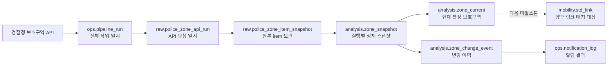
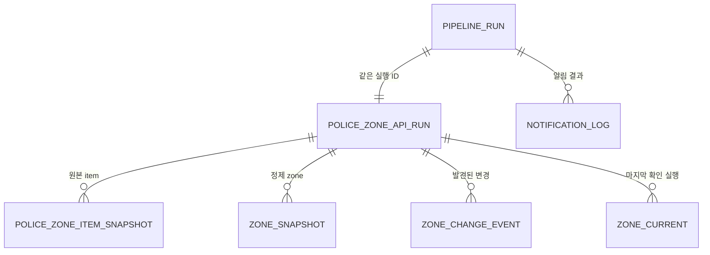

# 보호구역 모니터링 DB 테이블 이해 가이드

이 문서는 `mobility_db` 안에 추가된 보호구역 모니터링 테이블을 처음 보는 사람도 이해할 수
있도록 설명한다. 표준노드링크 원본·작업 테이블은 그대로 두고, 보호구역 자동화가 사용하는
테이블만 다룬다.

## 1. 먼저 알아둘 개념

PostgreSQL의 **스키마(schema)**는 관련 테이블을 묶어 놓은 서랍과 같다.

| 스키마 | 쉬운 의미 | 이 시스템에서 보관하는 것 |
|---|---|---|
| `raw` | 받은 그대로 보관하는 원본 서랍 | API 응답과 실행 정보 |
| `analysis` | 정리·비교한 결과 서랍 | 보호구역 geometry, 현재 상태, 변경 이력 |
| `ops` | 운영 기록 서랍 | 파이프라인 성공/실패와 알림 이력 |
| `mobility` | 기존 표준노드링크 서랍 | `std_link`, `std_node`, `std_multilink` |

핵심 원칙은 다음과 같다.

1. API에서 받은 원본은 `raw`에 남긴다.
2. 분석 가능한 Polygon만 EPSG:5179로 변환하여 `analysis`에 넣는다.
3. 매 실행 결과와 오류는 `ops`에 남긴다.
4. 기존 `mobility` 표준노드링크는 읽기만 하며 변경하지 않는다.

## 2. 전체 흐름 한눈에 보기



실행 한 번마다 하나의 UUID가 생성된다. 이 값은 `pipeline_run_id` 또는 `run_id`라는 이름으로
각 테이블을 연결한다. 쉽게 말하면 한 번의 실행에 붙는 **접수번호**다.

## 3. 테이블 관계도



`zone_current`는 실행별 행을 계속 쌓는 테이블이 아니라 현재 상태를 한 행씩 유지한다.
과거 상태는 `zone_snapshot`과 `zone_change_event`에서 확인한다.

## 4. 실행 단계별로 이해하기

### 4.1 실행 시작: `ops.pipeline_run`

파이프라인이 시작되면 가장 먼저 한 행이 만들어진다.

| 주요 컬럼 | 의미 |
|---|---|
| `pipeline_run_id` | 실행 접수번호, PK |
| `started_at`, `finished_at` | 시작·종료 시각 |
| `status` | `RUNNING`, `SUCCESS`, `FAILED` |
| `monitored_sgg_codes` | 이번 실행에서 확인한 시군구 코드 목록 |
| `fetched_count` | API에서 받은 전체 item 수 |
| `polygon_count` | 분석 대상으로 정제된 Polygon 수 |
| `skipped_non_polygon_count` | Point 등 분석에서 제외한 수 |
| `skipped_inactive_count` | `useYn` 비활성으로 제외한 수 |
| `new_count` | 새 보호구역 수 |
| `geometry_changed_count` | geometry만 변경된 수 |
| `attribute_changed_count` | 속성만 변경된 수 |
| `geometry_attribute_changed_count` | geometry와 속성이 모두 변경된 수 |
| `unchanged_count` | 직전과 동일한 수 |
| `deleted_count` | 이번 수집에서 사라지거나 비활성화된 수 |
| `error_message` | 실패 원인 |
| `notification_sent_at` | 변경 알림 전송 시각 |

이 테이블 하나만 보면 오늘 작업이 성공했는지와 변경 건수를 빠르게 알 수 있다.

### 4.2 API 요청 기록: `raw.police_zone_api_run`

`pipeline_run`과 1:1로 대응하는 API 수집 전용 일지다.

| 주요 컬럼 | 의미 |
|---|---|
| `run_id` | `ops.pipeline_run.pipeline_run_id`를 참조하는 PK/FK |
| `requested_at`, `completed_at` | API 수집 시작·종료 시각 |
| `source_endpoint` | 호출한 경찰청 API 주소 |
| `monitored_sgg_codes` | 요청한 시군구 범위 |
| `response_count` | 응답으로 받은 item 수 |
| `error_count`, `error_message` | API 오류 수와 내용 |

`ops.pipeline_run`은 전체 파이프라인 관점이고, 이 테이블은 API 통신 관점이라는 차이가 있다.

### 4.3 원본 보관: `raw.police_zone_item_snapshot`

API에서 받은 각 item을 수정하지 않고 저장한다. Point도 버리지 않고 여기에 보관한다.

| 주요 컬럼 | 의미 |
|---|---|
| `run_id`, `item_ordinal` | 복합 PK. 실행 안에서 몇 번째 item인지 표시 |
| `source_manage_no` | 경찰청 `ptznMngNo` |
| `sgg_code` | 시군구 코드 |
| `raw_json` | API item 전체 JSON |
| `raw_wkt` | API의 원본 `fturGeomVl`, EPSG:5181 |
| `payload_hash` | 원본 JSON이 동일한지 비교하는 SHA-256 |
| `captured_at` | DB에 보관한 시각 |

나중에 정규화 규칙이 바뀌어도 이 원본으로 다시 처리할 수 있다.

### 4.4 실행별 정제 결과: `analysis.zone_snapshot`

원본 중 Polygon 계열만 정리하여 실행별로 쌓는 이력 테이블이다.

| 주요 컬럼 | 의미 |
|---|---|
| `run_id`, `zone_id` | 복합 PK. 같은 실행에서 같은 보호구역은 한 번만 저장 |
| `zone_id` | `ptznMngNo` 기반의 안정적인 보호구역 식별 hash |
| `attr_hash` | geometry를 제외한 속성 hash |
| `geom_hash` | 정규화한 geometry hash |
| `data_hash` | `attr_hash + geom_hash` |
| `attrs` | 정제된 속성 JSON |
| `geom` | 유효한 MultiPolygon, EPSG:5179 |
| `created_at` | 스냅샷 생성 시각 |

매일 42개가 수집되면 이 테이블에는 매일 42개씩 추가된다. 과거 모습 재현에 사용한다.

### 4.5 현재 상태: `analysis.zone_current`

현재 활성 상태인 보호구역만 한 행씩 유지하는 가장 자주 조회할 테이블이다. QGIS에서도 이
테이블을 기본 보호구역 레이어로 사용한다.

#### 식별·변경 컬럼

| 컬럼 | 의미 |
|---|---|
| `zone_id` | 보호구역 PK |
| `attr_hash`, `geom_hash`, `data_hash` | 변경 판정용 hash |
| `last_run_id` | 이 보호구역을 마지막으로 확인한 API 실행 |

#### 주요 업무 속성

| 컬럼 | API 원본 | 의미 |
|---|---|---|
| `source_manage_no` | `ptznMngNo` | 보호구역 관리번호 |
| `project_no` | `pjtNo` | 사업번호 |
| `facility_name` | `trgtFcltNm` | 대상 시설명 |
| `facility_type_code` | `fcltTypeCd` | 시설 유형 코드 |
| `facility_detail_type_code` | `fcltDtlTypeCd` | 시설 상세 유형 코드 |
| `representative_manage_no` | `rprsPtznMngNo` | 대표 보호구역 관리번호 |
| `use_yn` | `useYn` | 사용 여부 |
| `sgg_code` | `sggCd` | 시군구 코드 |
| `emdong_code` | `emdongCd` | 읍면동 코드 |
| `stdg_code` | `stdgCd` | 법정동 코드 |
| `assign_type` | `assignType` | 지정 구분 |
| `road_address`, `road_detail_address` | 도로명 주소 필드 | 도로명 주소 |
| `lot_address`, `lot_detail_address` | 지번 주소 필드 | 지번 주소 |
| `first_registered_on` | `frstRegDt` | 최초 등록일 |
| `last_modified_on` | `lastMdfcnDt` | 최종 변경일 |
| `geom` | `fturGeomVl` | MultiPolygon, EPSG:5179 |
| `attrs` | 위 속성의 정리본 | JSON 형태의 전체 정제 속성 |

#### 시간 컬럼

| 컬럼 | 의미 |
|---|---|
| `first_seen_at` | 시스템에서 처음 발견한 시각 |
| `last_seen_at` | 가장 최근 실행에서 확인한 시각 |
| `updated_at` | 실제 hash가 마지막으로 변경된 시각 |

재실행 결과가 `UNCHANGED`이면 `last_seen_at`만 갱신되고 `updated_at`은 유지된다. 삭제 또는
비활성으로 판단되면 현재 테이블에서 빠지지만 과거 스냅샷과 변경 이벤트는 남는다.

### 4.6 변경 이력: `analysis.zone_change_event`

실제로 변화가 있을 때만 행을 생성한다. `UNCHANGED`는 이 테이블에 저장하지 않고
`ops.pipeline_run.unchanged_count`로만 집계한다.

| 주요 컬럼 | 의미 |
|---|---|
| `event_id` | 이벤트 PK |
| `run_id` | 변경을 발견한 실행 |
| `zone_id` | 변경된 보호구역 |
| `change_type` | 변경 종류 |
| `old_*_hash`, `new_*_hash` | 변경 전후 hash |
| `old_snapshot`, `new_snapshot` | 변경 전후 속성 JSON |
| `detected_at` | 변경 감지 시각 |

변경 유형은 다음처럼 결정한다.

| 조건 | `change_type` | 의미 |
|---|---|---|
| 이전에 `zone_id`가 없음 | `NEW` | 신규 보호구역 |
| `attr_hash`만 다름 | `ATTRIBUTE_CHANGED` | 이름·주소·코드 등 변경 |
| `geom_hash`만 다름 | `GEOMETRY_CHANGED` | 보호구역 경계 변경 |
| 두 hash가 모두 다름 | `GEOMETRY_ATTRIBUTE_CHANGED` | 속성과 경계 모두 변경 |
| 이번 실행에서 없음 또는 비활성 | `DELETED` | 현재 상태에서 제거 |
| 두 hash가 같음 | 이벤트 없음 | `UNCHANGED` 집계만 증가 |

### 4.7 알림 기록: `ops.notification_log`

Slack 또는 Telegram 알림을 시도했을 때 결과를 남긴다.

| 주요 컬럼 | 의미 |
|---|---|
| `notification_id` | 알림 로그 PK |
| `pipeline_run_id` | 어떤 실행의 알림인지 표시 |
| `channel` | `slack` 또는 `telegram` |
| `status` | `SENT` 또는 `FAILED` |
| `sent_at` | 시도 시각 |
| `payload_summary` | 변경 건수 등 간략 요약 JSON |
| `error_message` | 실패 원인 |

변경이 0건이면 알림을 보내지 않으므로 로그도 추가되지 않는다.

## 5. 종로구 테스트로 보는 실제 데이터 이동

### 첫 실행

1. `ops.pipeline_run`에 실행 1건 생성
2. API 원본 51건을 `raw.police_zone_item_snapshot`에 저장
3. Point 등 9건을 분석에서 제외
4. Polygon 42건을 `analysis.zone_snapshot`에 저장
5. 처음 본 보호구역이므로 `analysis.zone_current`에 42건 생성
6. `analysis.zone_change_event`에 `NEW` 42건 생성

### 두 번째 실행

1. 새 실행 일지 1건 생성
2. 원본 51건과 정제 스냅샷 42건을 다시 이력으로 추가
3. `zone_current`와 hash 비교
4. 42건이 모두 같으므로 `UNCHANGED=42`
5. 현재 보호구역 수는 42건 그대로 유지
6. 변경 이벤트와 알림은 생성하지 않음

세 번 실행한 현재 테스트 DB는 원본 153건, 정제 스냅샷 126건, 현재 보호구역 42건,
`NEW` 이벤트 42건이다. 이 숫자가 서로 다른 이유는 원본·과거·현재의 역할이 다르기 때문이다.

## 6. 자주 사용하는 조회 SQL

### 최근 실행 성공 여부

```sql
SELECT *
FROM ops.pipeline_run
ORDER BY started_at DESC
LIMIT 10;
```

### 현재 보호구역 보기

```sql
SELECT zone_id, facility_name, facility_type_code, sgg_code,
       road_address, first_seen_at, last_seen_at, updated_at
FROM analysis.zone_current
ORDER BY facility_name;
```

### geometry 품질 확인

```sql
SELECT
    COUNT(*) AS total,
    COUNT(*) FILTER (WHERE NOT ST_IsValid(geom)) AS invalid,
    COUNT(*) FILTER (WHERE ST_IsEmpty(geom)) AS empty,
    MIN(ST_SRID(geom)) AS min_srid,
    MAX(ST_SRID(geom)) AS max_srid
FROM analysis.zone_current;
```

정상 기준은 `invalid=0`, `empty=0`, `min_srid=max_srid=5179`다.

### 변경 이벤트 시간순 조회

```sql
SELECT detected_at, change_type, zone_id,
       old_snapshot ->> 'facility_name' AS old_name,
       new_snapshot ->> 'facility_name' AS new_name
FROM analysis.zone_change_event
ORDER BY detected_at DESC;
```

### 특정 보호구역의 실행별 이력

```sql
SELECT s.created_at, s.run_id, s.attr_hash, s.geom_hash, s.attrs
FROM analysis.zone_snapshot AS s
WHERE s.zone_id = '확인할_zone_id'
ORDER BY s.created_at;
```

## 7. QGIS에서는 무엇을 열어야 하나

- 일상 검수: `analysis.zone_current`
- 특정 날짜의 과거 상태: `analysis.zone_snapshot`을 `run_id`로 필터
- 변경 목록: `analysis.zone_change_event`
- 향후 링크 비교: `analysis.zone_current`와 `mobility.std_link`

지도에서 기본으로 열 테이블은 `analysis.zone_current`다. `raw_wkt`는 원본 확인용 문자열이며
지도 레이어가 아니다.

## 8. 수정하면 안 되는 영역

- `raw.raw_std_link_20260612`
- `raw.raw_std_node_20260612`
- `raw.raw_std_multilink_20260612`
- `mobility.std_link`
- `mobility.std_node`
- `mobility.std_multilink`
- 기존 멀티링크 뷰와 `postgres_data` 볼륨

보호구역 자동화의 migration은 `raw.police_zone_*`, `analysis.zone_*`, `ops.*` 범위에서만
작동해야 한다.
