# 표준링크 매칭 라이브 검수 기록 - 2026-07-10

이 문서는 2026-07-10 QGIS 육안 검수 중 사용자가 전달한 케이스를 순서대로 누적한다. 사용자가 `끝`이라고 말하기 전까지는 규칙을 즉시 수정하지 않고, 케이스를 분류하고 판단 근거를 축적한다.

## Case 2026-07-10-001: 보호구역과 무관한 상단/외곽 도로 후보 제외 정상

분류:

```text
판정: 제외 정상
유형: TRUE_NEGATIVE / EXCLUSION_VALID
관련 후보: 보호구역과 무관한 상단 또는 외곽 도로축
관련 규칙 후보: NO_AB_SEED, EXTENDED_BUT_NOT_NODE_CONNECTED, TOUCH_OR_GRAZE
```

스크린샷:

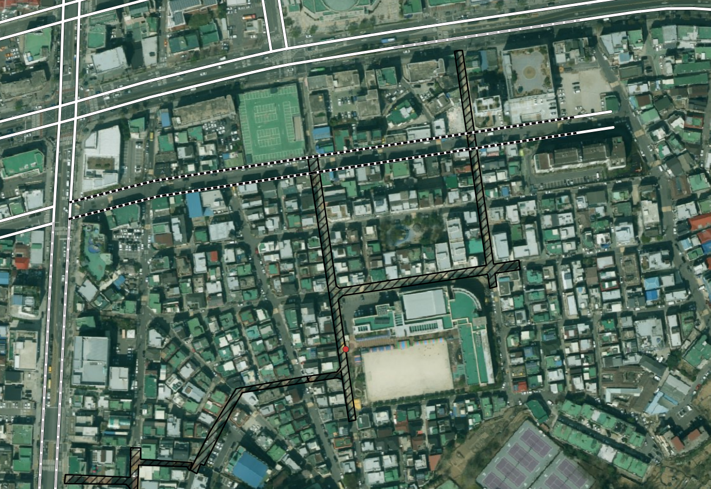

관찰 내용:

- 보호구역 폴리곤은 학교 주변 이면도로/생활도로 축을 따라 형성되어 있다.
- 상단의 넓은 도로 또는 외곽 도로축은 같은 화면에 보이지만, 실제 보호구역 운영 대상 도로로 보기는 어렵다.
- 해당 후보가 제외된 상태가 사용자 육안 검수 기준으로 정상이다.

원인 추정:

- 보호구역과 가까운 주변 도로가 존재하더라도, 보호구역 폴리곤의 실제 운영 축과 무관한 도로는 자동 확장 매칭하면 안 된다.
- 기존 제외 규칙이 이 유형에서는 정상적으로 작동한 것으로 판단한다.

다음 규칙 개선 후보:

```text
keep_excluded_unrelated_outer_axis:
  candidate is excluded
  AND candidate road axis is outside the effective protection-zone corridor
  AND candidate is not same-road or node-connected to a strong seed
  => keep excluded
```

## Case 2026-07-10-002: 연속 보호구역 축 일부가 제외되었으나 포함되어야 하는 케이스

분류:

```text
판정: 제외 오류 / 누락
유형: FALSE_NEGATIVE / SHOULD_INCLUDE
관련 후보: 보호구역 폴리곤의 연속 수평 축 일부
관련 규칙 후보: A_NEAR_PARALLEL_CORRIDOR, C_NEAR_CONNECTED_OR_SAME_ROAD, EXTENDED_BUT_NOT_NODE_CONNECTED
```

스크린샷:

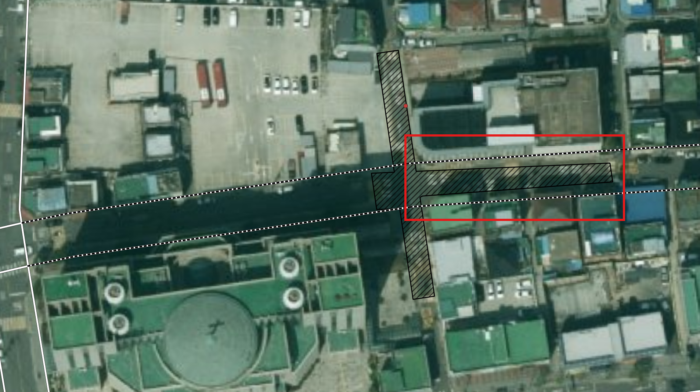

관찰 내용:

- 적색 박스로 표시된 수평 구간은 보호구역 폴리곤의 기존 수평 축과 같은 도로 선형으로 이어져 있다.
- 해당 구간은 폴리곤과 직접 중첩이 약하거나 끊겨 보일 수 있으나, 실제 보호구역 운영 구간의 연속부로 판단된다.
- 현재 제외되어 있으므로 자동 구축 대상에서 빠질 위험이 있다.

원인 추정:

- 보호구역 폴리곤이 도로 중심축 전체를 충분히 덮지 못하거나, 표준링크와 폴리곤 사이에 위치 오차가 있어 직접 중첩 기준을 만족하지 못한 것으로 보인다.
- 기존 A/B seed와 같은 도로축으로 이어져 있지만, 노드 연결 또는 근접 평행 조건이 충분히 인정되지 않아 제외된 가능성이 있다.

다음 규칙 개선 후보:

```text
include_continuous_corridor_segment:
  candidate is excluded
  AND candidate is near the protection-zone polygon or buffer
  AND candidate is collinear/parallel with an accepted A/B seed
  AND candidate continues the same local road corridor
  AND candidate is not a structure/outer arterial false-positive
  => include as A_NEAR_PARALLEL_CORRIDOR or C_NEAR_CONNECTED_OR_SAME_ROAD
```

검토 포인트:

- 같은 `zone_group_id` 내 A/B seed와 `road_name`, `road_no`, 노드 연결, 선형 방향성이 얼마나 일치하는지 확인한다.
- 직접 노드 연결이 없더라도 같은 도로축의 연속 구간이면 보정 후보로 올릴 필요가 있다.
- 단, Case 2026-07-10-001처럼 보호구역과 무관한 외곽 도로축까지 확장하지 않도록 거리/방향/구조물 플래그를 함께 사용해야 한다.

## Case 2026-07-10-003: 큰 보호구역 경계와 주요 도로축 정상 매칭

분류:

```text
판정: 정상
유형: TRUE_POSITIVE / SHOULD_INCLUDE
관련 후보: 큰 보호구역 경계와 같은 흐름의 주요 도로축
관련 규칙 후보: A_STRONG_OVERLAP, A_NEAR_PARALLEL_CORRIDOR, C_NEAR_CONNECTED_OR_SAME_ROAD
```

스크린샷:

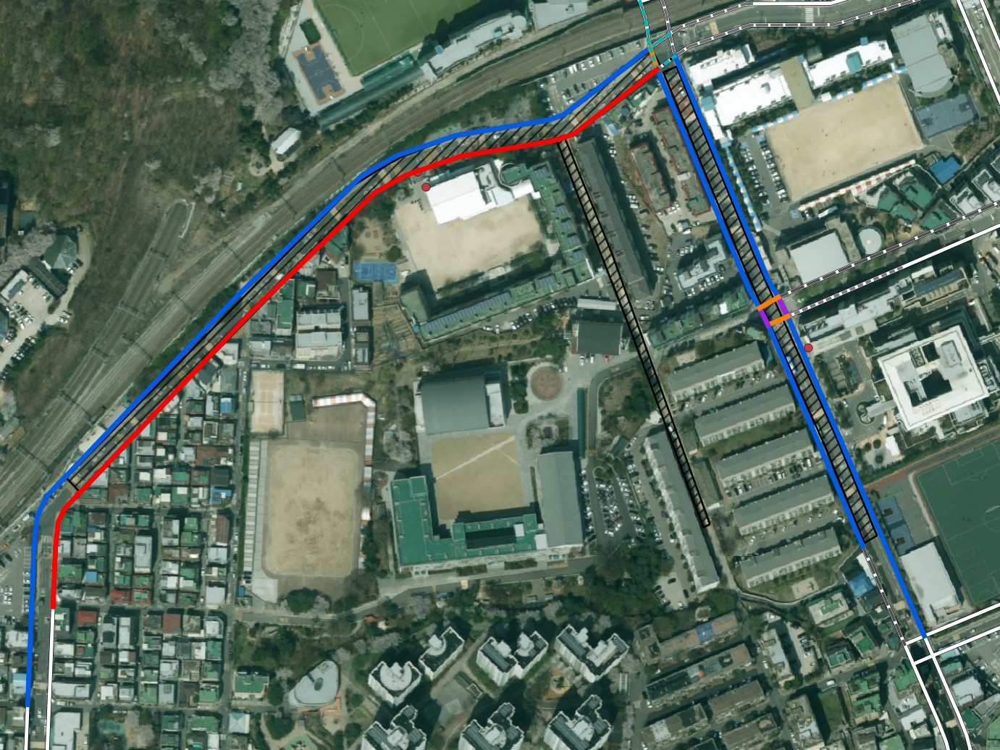

관찰 내용:

- 보호구역 경계가 넓은 범위의 학교 주변 도로축을 따라 형성되어 있다.
- 후보 링크가 보호구역 경계 또는 그 주변 도로 흐름과 같은 축으로 이어져 있다.
- 일부 교차부와 보조 후보가 함께 보이지만, 전체적으로 보호구역 운영 대상 도로를 잘 포착한 것으로 판단된다.

원인 추정:

- 보호구역 폴리곤과 표준링크가 완전히 일치하지 않더라도, 도로축의 방향성과 보호구역 범위가 일관되어 정상 매칭으로 볼 수 있다.
- 큰 보호구역에서는 A1 직접중첩뿐 아니라 A3 근접평행/연속축 보정이 유효하게 작동해야 한다.

다음 규칙 개선 후보:

```text
keep_valid_large_corridor_match:
  candidate follows the main boundary/corridor of a large protection zone
  AND candidate is directionally consistent with accepted seed links
  AND candidate is not a disconnected outer arterial false-positive
  => keep included
```

검토 포인트:

- 큰 보호구역에서는 폴리곤 외곽선과 표준링크 사이의 이격이 어느 정도 있어도 정상일 수 있다.
- 링크가 길더라도 보호구역 경계와 같은 방향으로 이어지는 경우, 전체 제외보다는 구간 클리핑 또는 연속축 매칭 후보로 관리하는 것이 적절하다.

## Case 2026-07-10-004: 긴 표준링크가 폴리곤 밖까지 표시되지만 정상

분류:

```text
판정: 정상
유형: TRUE_POSITIVE / LONG_LINK_DISPLAY_OVERREACH_BUT_VALID
관련 후보: 보호구역과 유효하게 맞는 긴 표준링크
관련 규칙 후보: A_STRONG_OVERLAP, A_NEAR_PARALLEL_CORRIDOR, C_NEAR_CONNECTED_OR_SAME_ROAD
```

스크린샷:

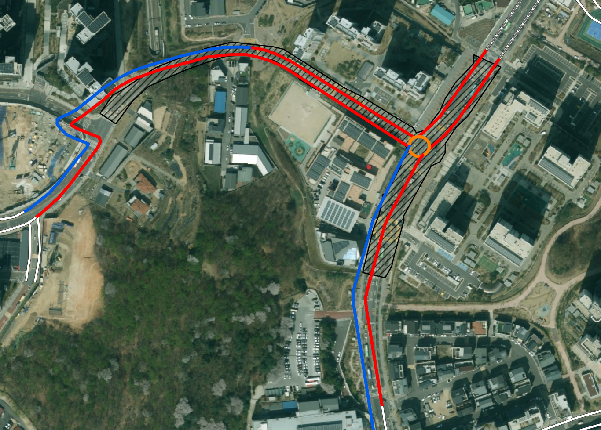

관찰 내용:

- 하단 링크가 보호구역 폴리곤 범위보다 길게 표시된다.
- 그러나 이는 표준노드링크 자체가 긴 단위로 구축되어 있기 때문이며, 실제 보호구역과 접하는 주요 구간은 정상적으로 대응된다.
- 따라서 링크 전체가 길게 보인다는 이유만으로 제외하면 안 된다.

원인 추정:

- 표준노드링크는 보호구역 단위가 아니라 노드-노드 도로구간 단위로 관리되므로, QGIS에서는 실제 보호구역 영향 구간보다 길게 표시될 수 있다.
- 링크 단위 후보 판정과 실제 운영 반영 구간은 분리해서 생각해야 한다.

다음 규칙 개선 후보:

```text
valid_long_link_with_partial_zone_overlap:
  link is long
  AND a meaningful part of the link overlaps or runs parallel to the protection-zone corridor
  AND the matched section follows the intended protection-zone road axis
  => keep included
  => later store/apply clipped affected segment separately
```

검토 포인트:

- 현재 단계에서는 링크 단위 매칭 후보로 정상 인정한다.
- 최종 자동 업데이트 단계에서는 `link_id` 전체 반영이 아니라 보호구역 영향 구간을 별도 segment/clipping geometry로 저장하는 설계가 필요하다.
- 이 유형은 오탐이라기보다 “표준링크 단위가 길어서 시각적으로 과잉 표시되는 정상 케이스”로 분류한다.

## Case 2026-07-10-005: 짧은 스침 또는 외곽 교차부 후보 제외 정상

분류:

```text
판정: 제외 정상
유형: TRUE_NEGATIVE / EXCLUSION_VALID
관련 후보: 보호구역 폴리곤 가장자리 또는 외곽 교차부를 짧게 스치는 링크
관련 규칙 후보: TOUCH_OR_GRAZE, TINY_ADJACENCY, EXTENDED_BUT_NOT_NODE_CONNECTED
```

스크린샷:

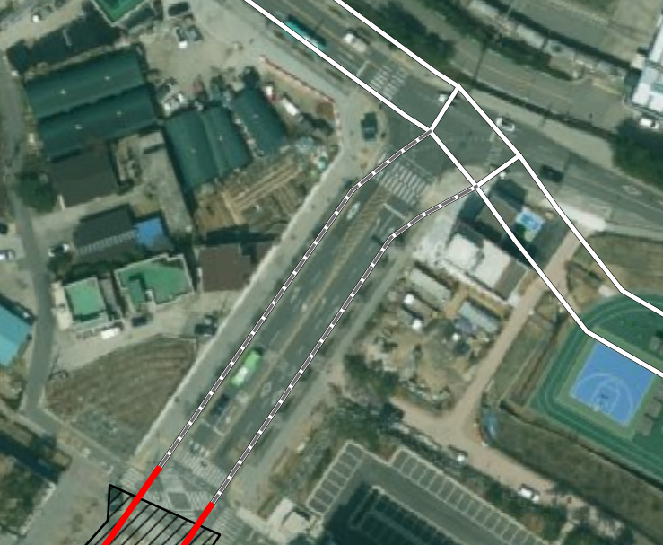

관찰 내용:

- 링크가 보호구역 또는 후보 영역의 가장자리와 짧게 접하거나 스쳐 지나가는 형태로 보인다.
- 보호구역의 주된 운영 도로축과 연결성이 강하지 않고, 외곽 교차부 또는 주변 도로로 판단된다.
- 제외된 상태가 사용자 육안 검수 기준으로 정상이다.

원인 추정:

- 단순히 일부 접촉하거나 매우 짧게 인접한 링크를 포함하면 보호구역 범위가 불필요하게 확장될 수 있다.
- 이 케이스는 직접 중첩/연속축 보정의 예외가 아니라, 기존 제외 규칙이 유지되어야 하는 유형이다.

다음 규칙 개선 후보:

```text
keep_excluded_short_graze:
  candidate has only short touch/graze/adjacency
  AND candidate is not on the main protection-zone corridor
  AND candidate is not a necessary junction component
  => keep excluded
```

검토 포인트:

- Case 2026-07-10-002처럼 같은 도로축으로 이어지는 누락 케이스와 구분해야 한다.
- 구분 기준은 짧은 접촉 여부뿐 아니라 주된 보호구역 축과의 방향성, 연결성, 연속성을 함께 봐야 한다.

## Case 2026-07-10-006: 강한 직접중첩이어도 고가도로/입체도로 주변은 자동확정 회피 필요

분류:

```text
판정: 부분 정상 / 자동확정 위험
유형: STRUCTURE_REVIEW_REQUIRED / A_STRONG_OVERLAP_BUT_RISKY
관련 후보: 화랑로 고가도로 및 입체도로 의심 구간 주변 링크
관련 규칙 후보: B_POTENTIAL_GRADE_SEPARATED, A_STRONG_OVERLAP, ELEVATED_ROAD_REVIEW
```

스크린샷:

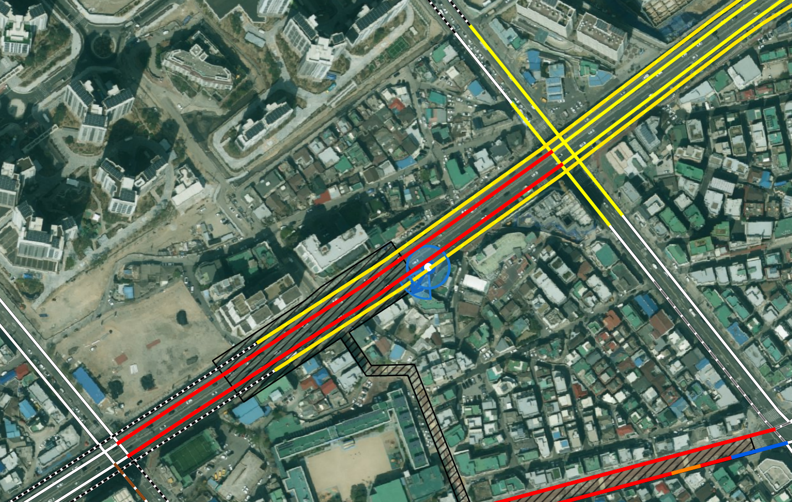

관찰 내용:

- 입체도로 의심 구간 자체는 정상적으로 검토 대상으로 뽑힌 것으로 보인다.
- 그러나 화랑로 고가도로 축이 보호구역 폴리곤과 강하게 직접중첩되어 `A_STRONG_OVERLAP` 성격으로 처리될 수 있다.
- 사용자는 고가도로 의심 구간 주변은 자동매칭을 피하는 것이 더 적절하다고 판단했다.

원인 추정:

- 2D 공간 중첩 기준만 보면 고가도로와 보호구역 폴리곤이 강하게 겹칠 수 있다.
- 하지만 실제 보호구역 운영 대상은 지상 접근도로/생활도로일 수 있으므로, 고가도로 또는 입체도로 구조물이 개입된 구간은 A 등급이라도 자동확정하면 위험하다.
- `road_type = 001`, 도로명 고가도로 키워드, 주변 병렬/교차 구조물 링크 존재 여부를 함께 봐야 한다.

다음 규칙 개선 후보:

```text
demote_auto_match_near_elevated_structure:
  candidate = A_STRONG_OVERLAP
  AND (
    road_type = '001'
    OR road_name contains elevated-road keyword
    OR nearby same corridor has B_POTENTIAL_GRADE_SEPARATED / ELEVATED_ROAD_REVIEW
  )
  => keep candidate but review_status = NEEDS_REVIEW
  => do not auto-apply
```

검토 포인트:

- 고가/지하/터널/교량 등 구조물 플래그가 있는 후보는 A1 직접중첩이라도 자동 반영 대상에서 제외하거나 별도 검토로 낮추는 것이 안전하다.
- 다만 북부간선도로처럼 구조물 링크 자체가 실제 보호구역 대상도로인 예외가 있으므로 자동 제외는 금물이다.
- 결론은 “자동 제외”가 아니라 “자동확정 회피 + 구조물 검토 큐로 이동”이 적절하다.

## Case 2026-07-10-007: 입체도로 주변은 단순 공간비교로 확정 불가, 수동매칭 대상

분류:

```text
판정: 수동검토 필요
유형: MANUAL_MATCH_REQUIRED / GRADE_SEPARATED_AREA
관련 후보: 고가도로/입체도로 주변의 복합 도로축
관련 규칙 후보: B_POTENTIAL_GRADE_SEPARATED, ELEVATED_ROAD_REVIEW, STRUCTURE_REVIEW_REQUIRED
```

스크린샷:

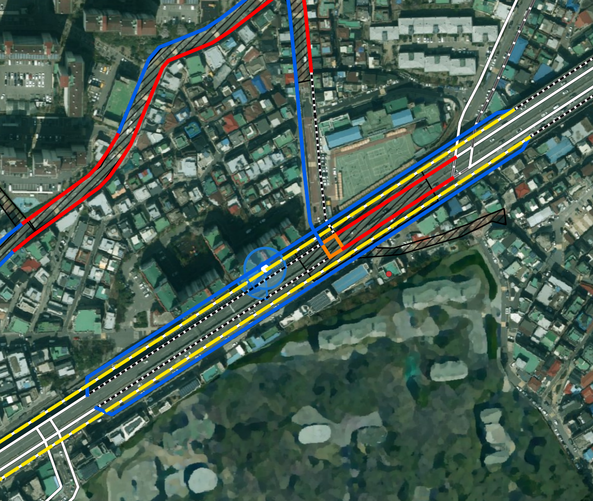

관찰 내용:

- 입체도로 주변에서 여러 표준링크가 보호구역 폴리곤 또는 주변 도로축과 겹치거나 근접한다.
- 단순 2D 공간 비교만으로는 어느 링크가 실제 보호구역 대상 도로인지 확정하기 어렵다.
- 표준노드링크에 고가도로/하부도로를 충분히 구분할 수 있는 속성이 없거나, 속성만으로 현장 구조를 확정하기 어려운 경우 해당 지역은 수동매칭지점으로 보는 것이 적절하다.

원인 추정:

- 고가도로, 하부도로, 측도, 연결로가 같은 평면 위치에 중첩되거나 가까이 존재한다.
- 항공영상과 표준링크만으로는 수직 구조 또는 실제 통행 접근성을 안정적으로 판단하기 어렵다.
- 자동매칭 로직이 강한 직접중첩 또는 근접평행을 만족하더라도 실제 대상 도로를 잘못 선택할 위험이 있다.

다음 규칙 개선 후보:

```text
manual_review_for_grade_separated_area:
  candidate is near a suspected grade-separated corridor
  AND multiple road axes/levels overlap in 2D
  AND structure attributes are absent, ambiguous, or conflicting
  => keep candidates
  => review_status = MANUAL_REVIEW_REQUIRED
  => do not auto-apply
```

검토 포인트:

- 이 유형은 자동 제외가 아니라 자동확정 금지가 핵심이다.
- 구조물 플래그가 명확하지 않더라도, 주변 도로 형태가 입체도로로 의심되면 수동검토 큐로 보내야 한다.
- 향후에는 `road_type`, `road_rank`, `connect`, 도로명 키워드, 주변 다중 평행축 개수, 교차 구조를 조합해 `grade_separated_area_flag`를 만드는 방안을 검토한다.

## Case 2026-07-10-008: 하단 약한중첩 판정 사유 확인 필요

분류:

```text
판정: 보류 / 사유 확인 필요
유형: WEAK_OVERLAP_CLASSIFICATION_SUSPECT
관련 후보: 하단 B 약한중첩 후보
관련 규칙 후보: B_WEAK_OVERLAP, A_STRONG_OVERLAP, A_NEAR_PARALLEL_CORRIDOR
```

스크린샷:

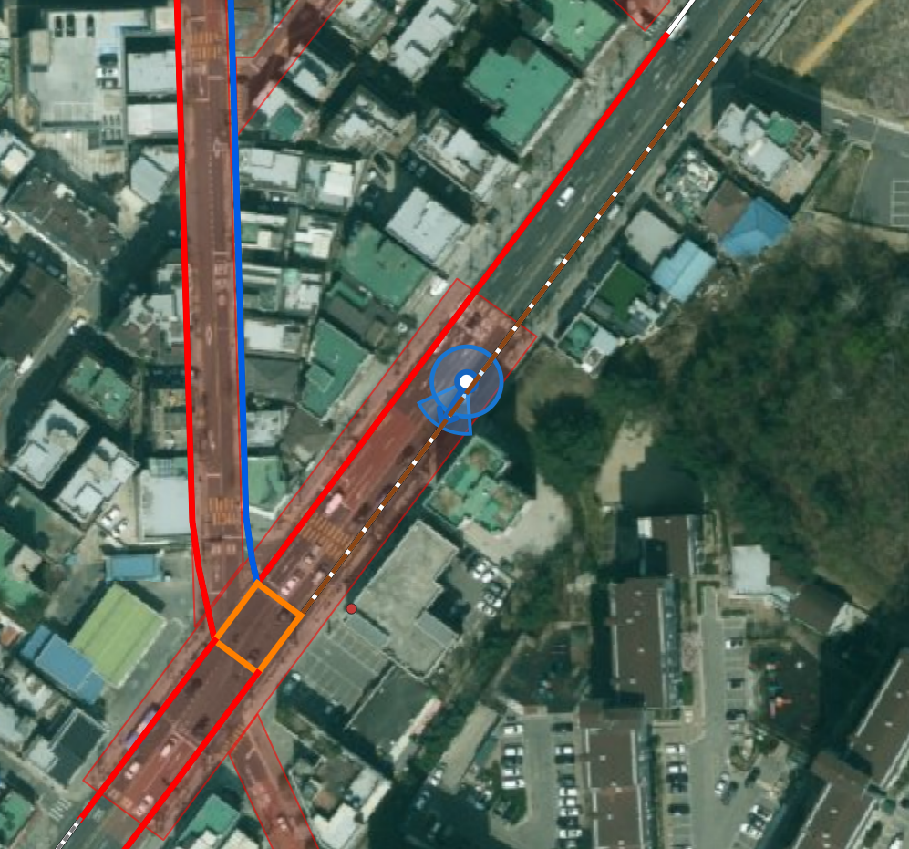

관찰 내용:

- 하단 후보가 `B_WEAK_OVERLAP` 성격으로 보이나, 육안상 단순 약한중첩으로 보기 어렵다.
- 보호구역 폴리곤 또는 도로축과 의미 있게 겹치는 것처럼 보이며, 왜 A가 아닌 B로 내려갔는지 사유 확인이 필요하다.
- 특히 중첩 길이, 중첩 비율, 링크 길이, 고가/입체도로 플래그 영향 여부를 확인해야 한다.

원인 추정:

- 링크 전체 길이가 길어 `intersection_ratio`가 낮게 계산되었을 가능성이 있다.
- 실제 중첩 구간은 충분하지만, 표준링크 단위가 길어 비율 기준에서 B로 내려갔을 수 있다.
- 또는 입체도로/구조물 의심 조건이 개입되어 자동 A 확정을 피한 결과일 수 있다.

다음 확인 쿼리 후보:

```sql
SELECT
    candidate_grade,
    match_rule_code,
    distance_m,
    intersection_length_m,
    link_length_m,
    intersection_ratio,
    proximity_overlap_length_m,
    proximity_overlap_ratio,
    road_type,
    road_type_name,
    connect,
    connect_name,
    structure_review_flag,
    link_structure_category
FROM analysis.v_zone_link_match_candidate_v2
WHERE source_manage_no = '<해당 보호구역 관리번호>'
ORDER BY candidate_grade, match_rule_code, intersection_length_m DESC;
```

다음 규칙 개선 후보:

```text
weak_overlap_due_to_long_link:
  candidate = B_WEAK_OVERLAP
  AND intersection_length_m is meaningful
  AND intersection_ratio is low only because link_length_m is long
  AND candidate follows the intended protection-zone corridor
  => consider A_NEAR_PARALLEL_CORRIDOR or NEEDS_REVIEW_HIGH
```

검토 포인트:

- `B_WEAK_OVERLAP`이 항상 낮은 품질 후보라는 뜻은 아니다.
- 긴 링크에서 비율 기준만 낮아진 경우는 Case 2026-07-10-004와 같은 “긴 링크 표시 과잉이지만 정상” 유형과 연결해서 봐야 한다.
- 반대로 입체도로 의심 구간이면 A로 올리기보다 수동검토로 유지해야 한다.

## Case 2026-07-10-009: 20m 내 후보없음 정상 - 생활도로/골목 표준링크 미구축

분류:

```text
판정: 정상
유형: TRUE_NEGATIVE / NO_CANDIDATE_WITHIN_20M_VALID
관련 후보: 표준링크 후보 없음
관련 규칙 후보: NO_CANDIDATE_WITHIN_20M
```

스크린샷:

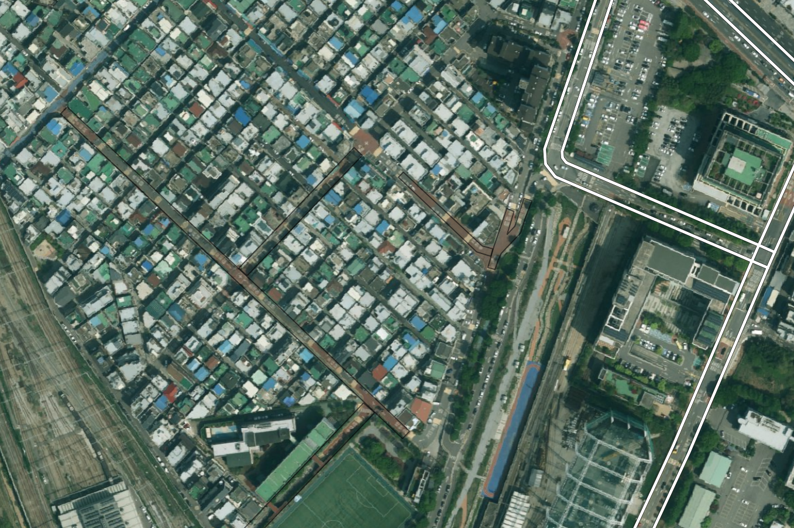

관찰 내용:

- 보호구역 폴리곤은 주거지 내부 생활도로 또는 골목 축을 따라 존재한다.
- 20m 이내에 대응 가능한 표준링크 후보가 없으며, 주변 표준링크는 우측 외곽 큰 도로 또는 별도 간선축 위주로 존재한다.
- 사용자는 `20m 내 후보없음` 상태가 정상이라고 판단했다.

원인 추정:

- 표준노드링크 구축 대상에서 제외된 이면도로/골목/생활도로일 가능성이 있다.
- 이 경우 억지로 20m 바깥의 간선도로를 끌어오면 오히려 잘못된 자동 매칭이 된다.

다음 규칙 개선 후보:

```text
keep_no_candidate_for_unmapped_local_road:
  coverage_status = NO_CANDIDATE_WITHIN_20M
  AND protection-zone polygon follows local/residential road
  AND nearest standard links are outer arterials or unrelated corridors
  => keep as no standard-link candidate
  => manual note: standard-link absent / future source supplementation needed
```

검토 포인트:

- `NO_CANDIDATE_WITHIN_20M`은 항상 문제 상황이 아니다.
- 표준링크가 구축되지 않은 생활도로형 보호구역은 별도 상태값으로 구분해야 한다.
- 최종 자동 업데이트에서는 “자동 업데이트 불가: 표준링크 없음”으로 관리하는 것이 적절하다.

## Case 2026-07-10-010: 채택후보 없음 정상 - 주변 외곽도로만 존재

분류:

```text
판정: 정상
유형: TRUE_NEGATIVE / NO_ACCEPTED_CANDIDATE_VALID
관련 후보: 주변 표준링크는 있으나 보호구역 대상축과 직접 대응되지 않음
관련 규칙 후보: NO_ACCEPTED_CANDIDATE, NO_AB_SEED, EXTENDED_BUT_NOT_NODE_CONNECTED
```

스크린샷:

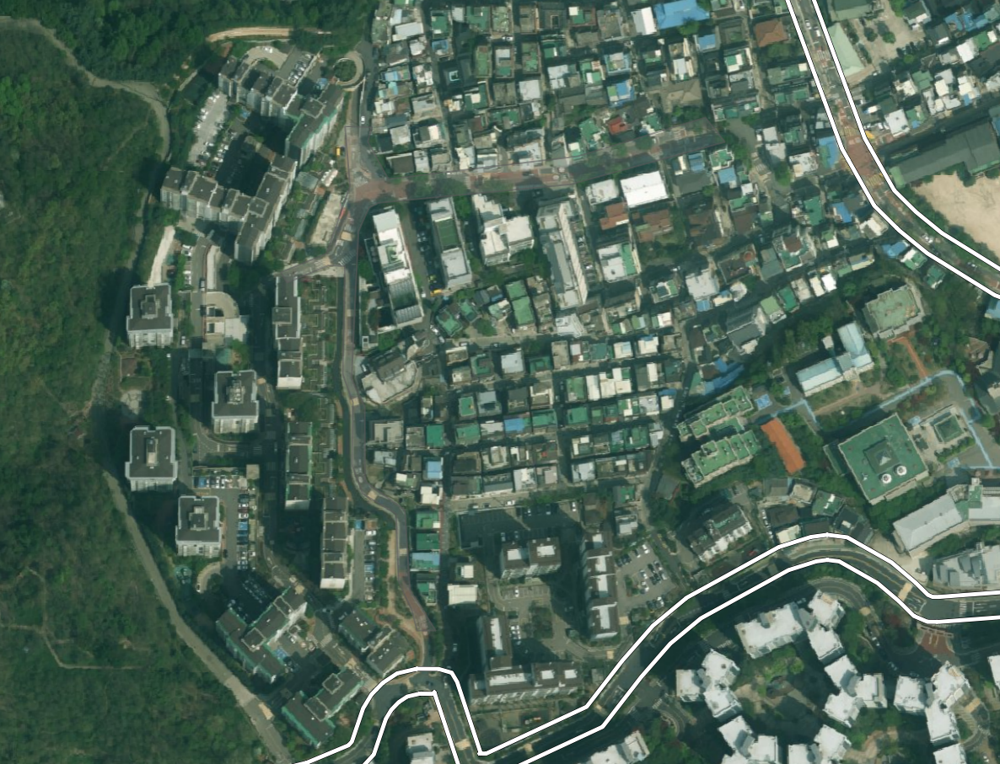

관찰 내용:

- 보호구역은 주거지 내부 또는 생활도로 축으로 형성된 것으로 보인다.
- 주변에는 외곽 큰 도로 표준링크가 존재하지만, 보호구역 대상도로와 직접 대응되는 표준링크로 보기 어렵다.
- 따라서 후보가 일부 있더라도 최종 채택후보가 없는 상태가 정상이다.

원인 추정:

- 표준링크는 외곽 주요 도로 위주로 구축되어 있고, 보호구역 내부 생활도로 또는 접근로는 표준링크로 표현되지 않았을 가능성이 있다.
- 주변 외곽도로를 억지로 채택하면 보호구역 대상도로가 아닌 링크를 자동 업데이트하게 된다.

다음 규칙 개선 후보:

```text
keep_no_accepted_candidate_when_only_outer_roads_exist:
  nearby standard links exist
  AND all candidates are outer arterials or unrelated roads
  AND no candidate follows the effective protection-zone local road axis
  => keep NO_ACCEPTED_CANDIDATE
  => classify as standard-link absent for target corridor
```

검토 포인트:

- `NO_ACCEPTED_CANDIDATE`도 항상 오류가 아니다.
- `NO_CANDIDATE_WITHIN_20M`과 달리 주변 후보는 있으나 모두 부적합한 경우다.
- 운영 상태값은 “후보 없음”과 “후보는 있으나 채택 없음”을 구분하되, 둘 다 정상일 수 있음을 반영해야 한다.

## Case 2026-07-10-011: 검토후보만 있음 정상 - 복잡한 생활도로형 보호구역

분류:

```text
판정: 정상
유형: REVIEW_ONLY_VALID / MATCHED_REVIEW_VALID
관련 후보: A 자동확정 없이 B/C/D 검토후보만 존재
관련 규칙 후보: MATCHED_REVIEW, C_NEAR_CONNECTED_OR_SAME_ROAD, D_EXTENDED_NODE_CONNECTED
```

스크린샷:

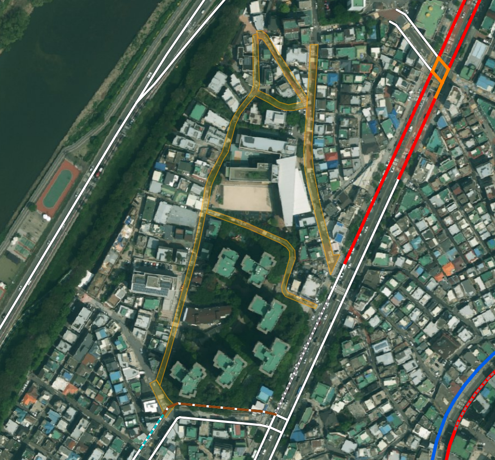

관찰 내용:

- 보호구역 내부 도로축은 학교 주변의 복잡한 생활도로/접근도로 형태로 보인다.
- 주변 표준링크는 외곽도로, 접근로, 약한 연결 후보 중심이며, 자동 A 확정 후보가 없는 것이 자연스럽다.
- 사용자는 `검토후보만 있음` 상태도 정상이라고 판단했다.

원인 추정:

- 표준링크가 보호구역 내부 생활도로 전체를 세밀하게 표현하지 못하거나, 폴리곤과 정확히 일치하지 않는다.
- 그러나 주변에 완전히 무관한 후보만 있는 것은 아니므로, 검토 후보로 남겨두는 것이 적절하다.
- 자동확정은 어렵지만 수동검토 큐에 올릴 의미는 있는 상태다.

다음 규칙 개선 후보:

```text
keep_review_only_for_complex_local_zone:
  coverage_status = MATCHED_REVIEW
  AND no A candidate exists
  AND B/C/D candidates are near or partially related to the local protection-zone corridor
  AND candidates are not safe enough for auto-apply
  => keep as review-only valid
```

검토 포인트:

- `MATCHED_REVIEW`는 오류가 아니라 정상적인 운영 상태일 수 있다.
- 자동 업데이트 대상과 수동검토 대상을 명확히 구분해야 한다.
- 검토후보만 있는 보호구역은 “자동 적용 불가”이지 “매칭 실패”는 아닐 수 있다.
