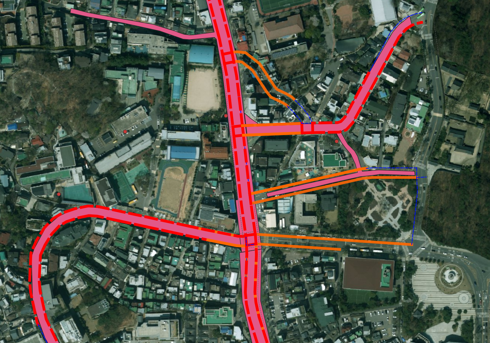
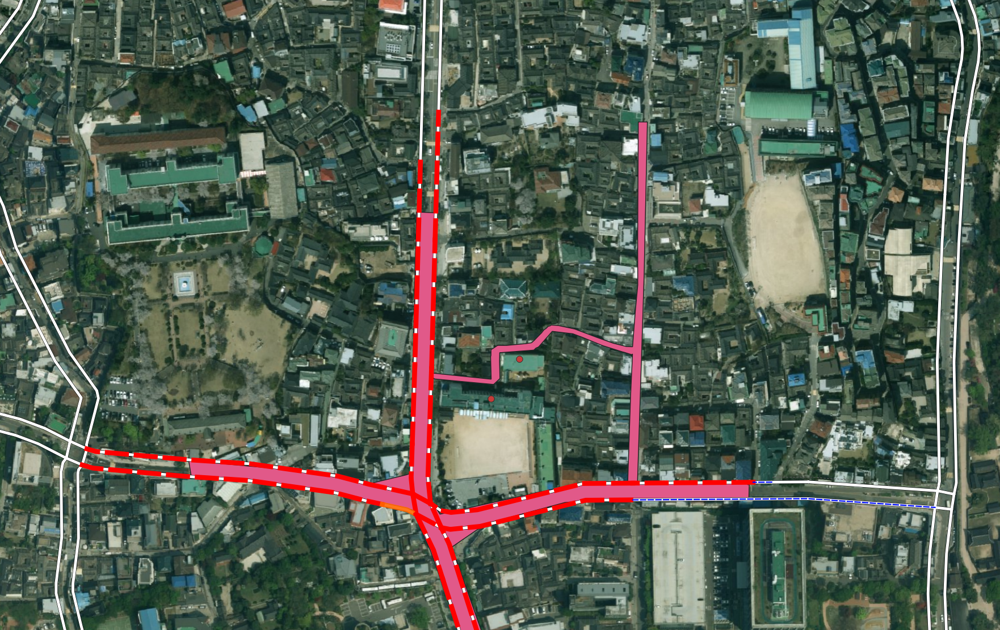
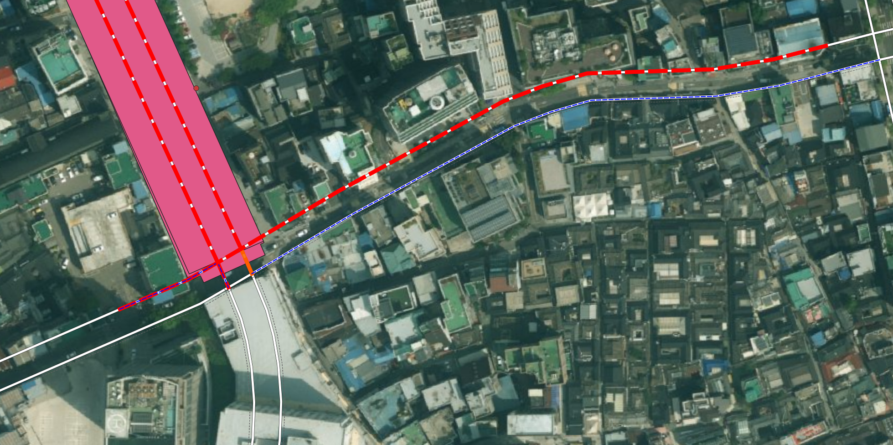
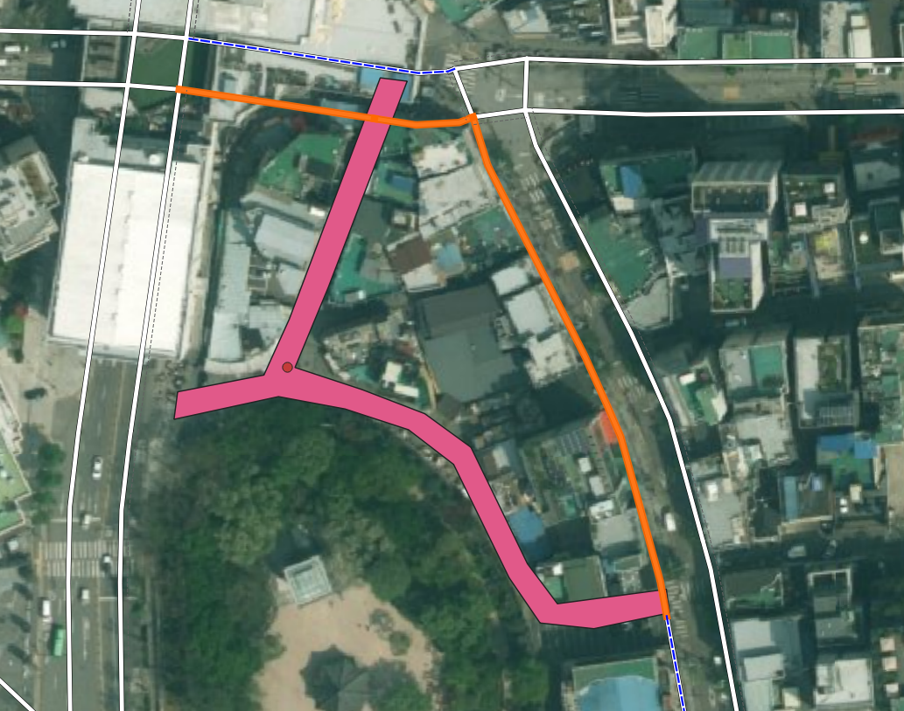
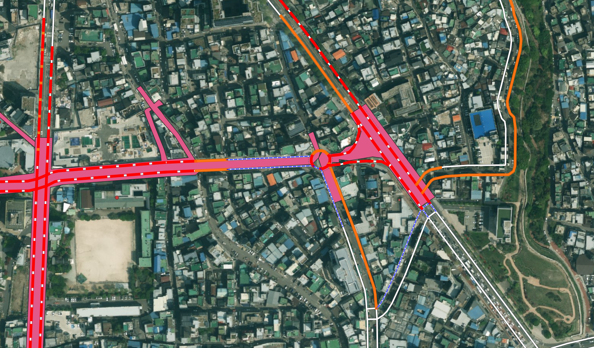

# 표준링크 매칭 1차 육안검수 스냅샷 및 2차 조건 정의

작성일: 2026-07-09

이 문서는 `analysis.v_zone_link_match_candidate`를 QGIS에서 육안검수하면서 확인한 1차 매칭 로직의 한계를 기록하고, 2차 테스트에서 적용할 후보 조건을 다시 정의하기 위한 문서다.

현재 1차 로직은 보호구역 폴리곤과 표준링크의 단순 교차 여부, 교차 길이, 최단거리만으로 A/B/C/D 후보를 만들었다. 이 방식은 빠르게 후보를 넓게 뽑는 데는 유용했지만, 실제 지도 검수에서는 “보호구역 도로”가 아니라 “보호구역을 스쳐 지나가는 링크”까지 후보로 들어오는 문제가 확인되었다.

## 1. 1차 검수에서 확인한 대표 케이스

### 케이스 1. C/D 거리 기반 후보의 과다 매칭

스냅샷:



증상:

- 보호구역 폴리곤과 직접 교차하지 않는 표준링크가 단순히 5m 또는 20m 안에 있다는 이유만으로 후보가 된다.
- 실제로는 평행 도로, 주변 이면도로, 경계 밖 도로가 섞여 들어온다.

의미:

- 거리만으로는 “보호구역과 같은 도로축에 있는 링크”인지 판단할 수 없다.
- C/D 등급은 단순 근접 후보가 아니라, A/B로 확인된 핵심 링크와의 연결성 또는 동일 도로성을 확인해야 한다.

2차 처리 방향:

- C/D는 독립적으로 생성하지 않는다.
- 먼저 A/B 핵심 후보를 만들고, 그 핵심 후보와 다음 중 하나를 만족할 때만 C/D 후보로 승격한다.
  - 같은 도로명 또는 같은 도로번호를 가진다.
  - 표준링크의 시작/종료 노드가 A/B 후보 링크와 직접 연결된다.
  - 보호구역 그룹 내부에서 동일한 도로축으로 판단할 수 있는 연속 링크다.

### 케이스 2. 표준링크가 존재하지 않는 보호구역

스냅샷:



증상:

- 보호구역 폴리곤은 존재하지만, 해당 구간에 대응되는 표준링크가 없거나 매우 떨어져 있다.
- 특히 내부 진입로, 학교 주변 소로, 공원/단지 내부 통행로처럼 표준노드링크망에 누락된 구간이 있다.

의미:

- 매칭 실패가 항상 알고리즘 실패는 아니다.
- 표준링크 데이터 자체의 커버리지 부족 또는 보호구역 원천 데이터의 상세 구간 표현 문제가 있을 수 있다.

2차 처리 방향:

- 후보가 없는 보호구역을 별도 상태로 남긴다.
- `NO_STANDARD_LINK_COVERAGE` 또는 `NO_CANDIDATE_WITHIN_20M` 같은 상태를 부여한다.
- 나중에 운영 반영 대상에서 제외할지, 수동 보정 링크를 만들지, 별도 관리 대상으로 둘지 판단한다.

### 케이스 3. A 등급의 횡단 교차 오탐

스냅샷:



증상:

- 표준링크가 보호구역 폴리곤을 직접 교차하기 때문에 A 등급으로 잡히지만, 실제로는 보호구역 도로축을 따라가는 링크가 아니라 폴리곤을 가로질러 지나가는 링크다.
- 교차 자체는 맞지만, 보호구역 구간을 대표한다고 보기 어렵다.

의미:

- “교차한다”는 조건만으로는 최우선 후보로 보기 어렵다.
- 링크가 보호구역 안에서 충분한 길이로 겹치는지, 링크 전체 길이 대비 보호구역 내부 비율이 충분한지 함께 봐야 한다.

2차 처리 방향:

- A 등급은 단순 교차가 아니라 “의미 있는 중첩”을 요구한다.
- 최소 교차 길이와 교차 비율을 동시에 만족해야 한다.
- 보호구역 안에 링크 중간점이 포함되는지도 보조 판단 지표로 둔다.

### 케이스 4. B 등급의 스침/접촉 오탐

스냅샷:



증상:

- 링크가 보호구역 가장자리나 코너를 살짝 스치는데 B 등급 후보로 들어온다.
- 실제로는 보호구역 경계를 따라가는 도로가 아니라 우연히 닿거나 잠깐 통과하는 경우다.

의미:

- B 등급도 “검토 후보”로 남기기에는 너무 많은 잡음이 생긴다.
- 스침 후보는 B가 아니라 제외 또는 별도 QC 상태로 분리하는 편이 낫다.

2차 처리 방향:

- 교차 길이가 매우 짧거나 교차 비율이 낮으면 `TOUCH_OR_GRAZE`로 분리한다.
- `TOUCH_OR_GRAZE`는 기본 후보 테이블에 넣더라도 운영 반영 후보에서는 제외한다.

### 케이스 5. 교차로/접합부 주변의 과다 후보

스냅샷:



증상:

- 보호구역 폴리곤이 교차로를 포함할 때, 교차로에 연결된 여러 링크가 동시에 후보로 잡힌다.
- 이 중 일부는 보호구역을 대표하는 도로가 아니라 교차로에서 잠깐 닿는 링크다.

의미:

- 교차로는 단순 교차 조건의 오탐이 집중되는 지점이다.
- 보호구역의 주 도로축과 교차로 가지 링크를 구분해야 한다.

2차 처리 방향:

- A/B 핵심 후보와 방향 또는 연속성이 맞지 않는 교차로 가지 링크는 자동 후보에서 제외한다.
- 교차로 후보는 `JUNCTION_REVIEW` 상태로 분리한다.

## 2. 2차 매칭 등급 재정의

2차 테스트의 핵심은 “넓게 많이 잡기”가 아니라 “오탐을 줄이고, 애매한 것은 검토 대상으로 분리하기”다.

### A: 강한 직접 중첩 후보

조건:

```text
polygon과 link가 교차
AND intersection_length_m >= 20m
AND intersection_ratio >= 0.20
AND touch_or_graze 아님
```

의미:

- 보호구역 내부에 표준링크가 충분한 길이로 들어와 있고, 링크 전체 기준으로도 의미 있는 비율을 차지한다.
- 자동 반영 후보가 될 가능성이 가장 높다.

보조 지표:

```text
link_midpoint_inside_zone = true
```

중간점 포함은 필수 조건으로 두기보다 신뢰도 보강 지표로 사용한다. 일부 긴 링크는 중간점이 보호구역 밖에 있을 수 있기 때문이다.

### B: 약한 직접 중첩 검토 후보

조건:

```text
polygon과 link가 교차
AND A 조건은 만족하지 않음
AND intersection_length_m >= 10m
AND intersection_ratio >= 0.10
AND touch_or_graze 아님
```

의미:

- 직접 교차는 하지만 A로 보기에는 약하다.
- 자동 반영하지 않고 QGIS/SQL 검토 대상으로 둔다.

### TOUCH_OR_GRAZE: 스침/접촉 후보

조건:

```text
polygon과 link가 교차
AND (
  intersection_length_m < 10m
  OR intersection_ratio < 0.10
)
```

의미:

- 보호구역과 닿기는 하지만 실제 보호구역 링크라고 보기 어렵다.
- 운영 반영 후보에서는 제외한다.
- 다만 품질관리와 알고리즘 개선을 위해 별도 조회 가능하게 남긴다.

### C: 가까운 연결 후보

조건:

```text
polygon과 link가 직접 교차하지 않음
AND distance_m <= 5m
AND 같은 보호구역 그룹 안에 A/B 핵심 후보가 존재
AND (
  A/B 핵심 후보와 같은 road_name 또는 road_no
  OR A/B 핵심 후보와 node 연결
)
```

의미:

- 원천 폴리곤 또는 표준링크 좌표 오차 때문에 약간 벗어난 후보를 보정하기 위한 등급이다.
- 단순 거리 후보가 아니라, 핵심 후보와 같은 도로축이라는 근거가 있어야 한다.

### D: 확장 연결 검토 후보

조건:

```text
polygon과 link가 직접 교차하지 않음
AND 5m < distance_m <= 20m
AND 같은 보호구역 그룹 안에 A/B 핵심 후보가 존재
AND A/B 핵심 후보와 node 연결
```

의미:

- 자동 반영 후보가 아니다.
- 보호구역 경계 오차, 표준링크 누락, 도로축 불일치 여부를 확인하기 위한 낮은 신뢰도 후보다.

### 제외

조건:

```text
distance_m > 20m
OR C/D 연결성 조건을 만족하지 않음
OR TOUCH_OR_GRAZE로 판단됨
```

의미:

- 기본 매칭 후보에서 제외한다.
- 필요하면 별도 QC 조회로만 확인한다.

## 3. 2차 구현 시 추가할 판단 컬럼

후보 테이블 또는 검토 뷰에 다음 컬럼을 추가한다.

```text
match_rule_code
match_rule_description
is_touch_or_graze
link_midpoint_inside_zone
same_road_as_seed
connected_to_seed
seed_link_id
rejection_reason
```

용도:

- 왜 A/B/C/D가 되었는지 설명 가능해야 한다.
- 왜 제외되었는지도 추적 가능해야 한다.
- QGIS에서 색상만 보는 것이 아니라 속성 테이블만으로도 판단 근거를 확인할 수 있어야 한다.

## 4. 2차 테스트용 검수 테이블/뷰 제안

기존 후보 뷰:

```text
analysis.v_zone_link_match_candidate
```

2차에서 추가할 뷰:

```text
analysis.v_zone_link_match_candidate_v2
analysis.v_zone_link_match_excluded_v2
analysis.v_zone_link_match_coverage_v2
```

각 뷰의 목적:

| 뷰 | 목적 |
| --- | --- |
| `analysis.v_zone_link_match_candidate_v2` | A/B/C/D 최종 검토 후보 |
| `analysis.v_zone_link_match_excluded_v2` | 스침, 거리 초과, 연결성 부족 등 제외 사유 확인 |
| `analysis.v_zone_link_match_coverage_v2` | 보호구역별 후보 존재 여부와 미매칭 보호구역 확인 |

## 5. QGIS 2차 검수 순서

1. A 등급만 켜고 보호구역 도로축과 실제로 겹치는지 확인한다.
2. B 등급을 켜고 스침/코너 접촉이 제거되었는지 확인한다.
3. C 등급을 켜고 A/B 후보와 같은 도로축으로 연결되는지 확인한다.
4. D 등급은 자동 반영 후보가 아니라 “누락 가능성 검토용”으로 본다.
5. `NO_STANDARD_LINK_COVERAGE` 보호구역을 따로 확인한다.
6. 검수 결과를 기준으로 A 자동 반영 가능 여부를 다시 판단한다.

## 6. 이번 검수의 결론

1차 로직은 후보를 빠르게 생성하는 MVP로는 성공했지만, 운영 반영 기준으로는 아직 넓다.

2차 로직에서는 다음 원칙을 적용한다.

- 단순 교차는 A가 아니다.
- 단순 근접은 C/D가 아니다.
- 스쳐 지나가는 링크는 후보가 아니라 별도 QC 대상이다.
- 표준링크가 없는 보호구역은 알고리즘 실패가 아니라 별도 커버리지 이슈로 관리한다.
- 자동 반영은 A 중에서도 검수로 안정성이 확인된 조건에만 제한한다.
