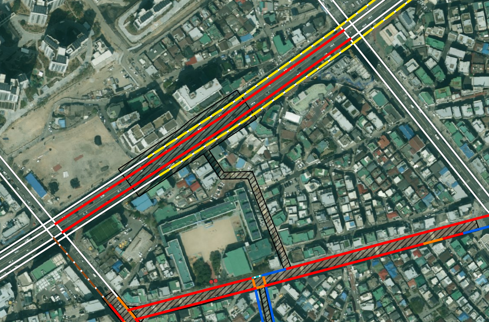
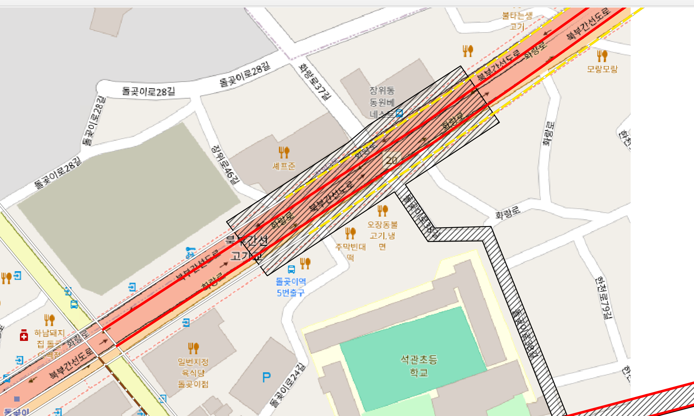
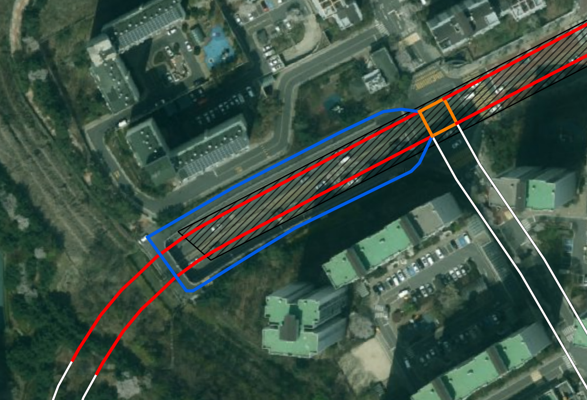
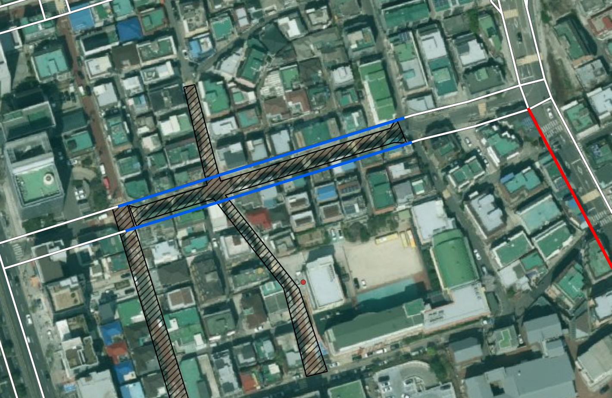
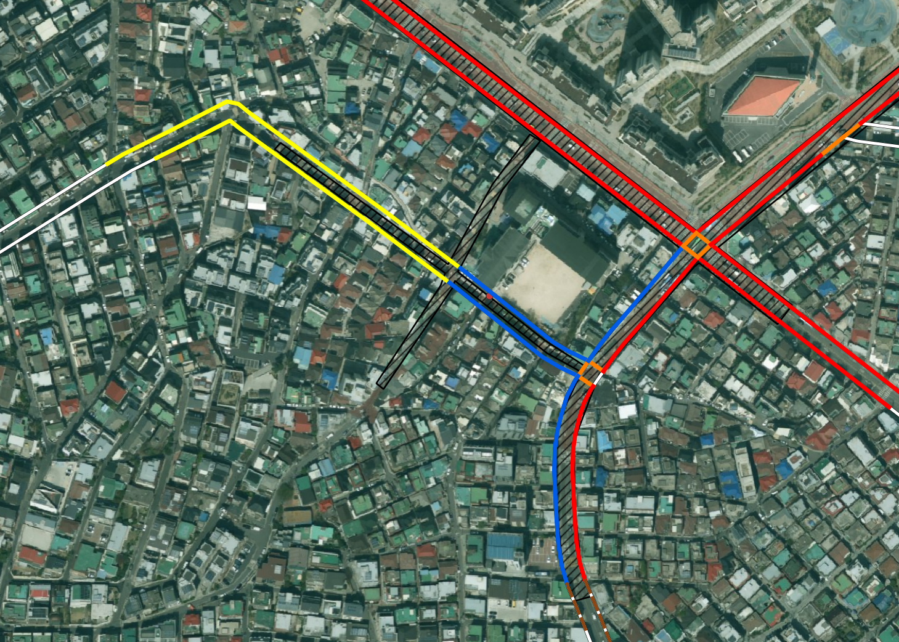
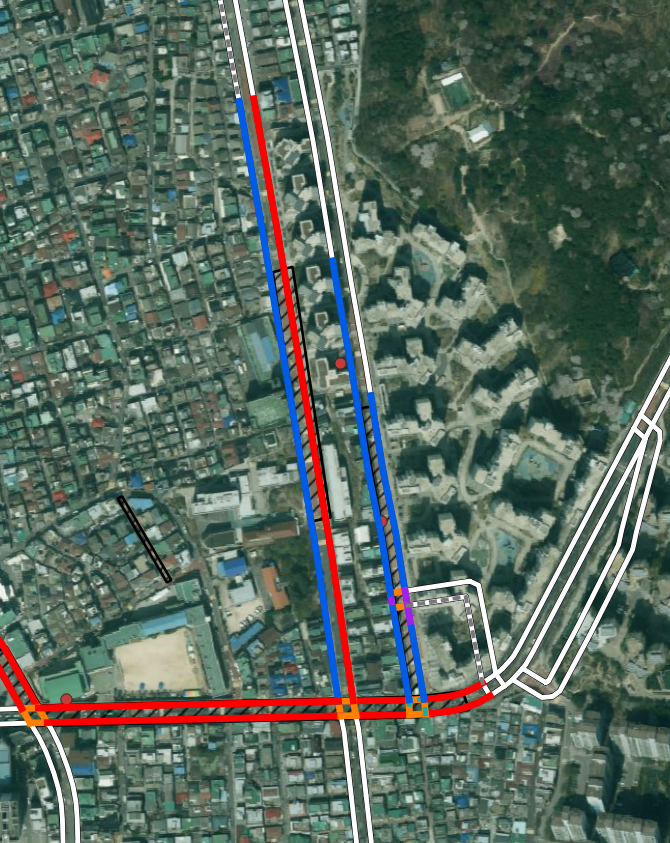
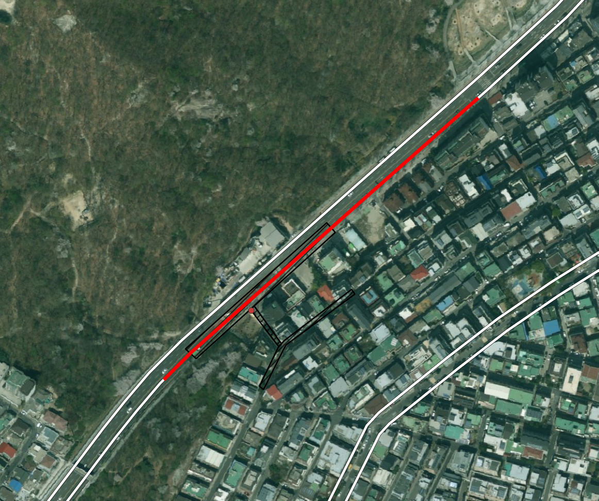
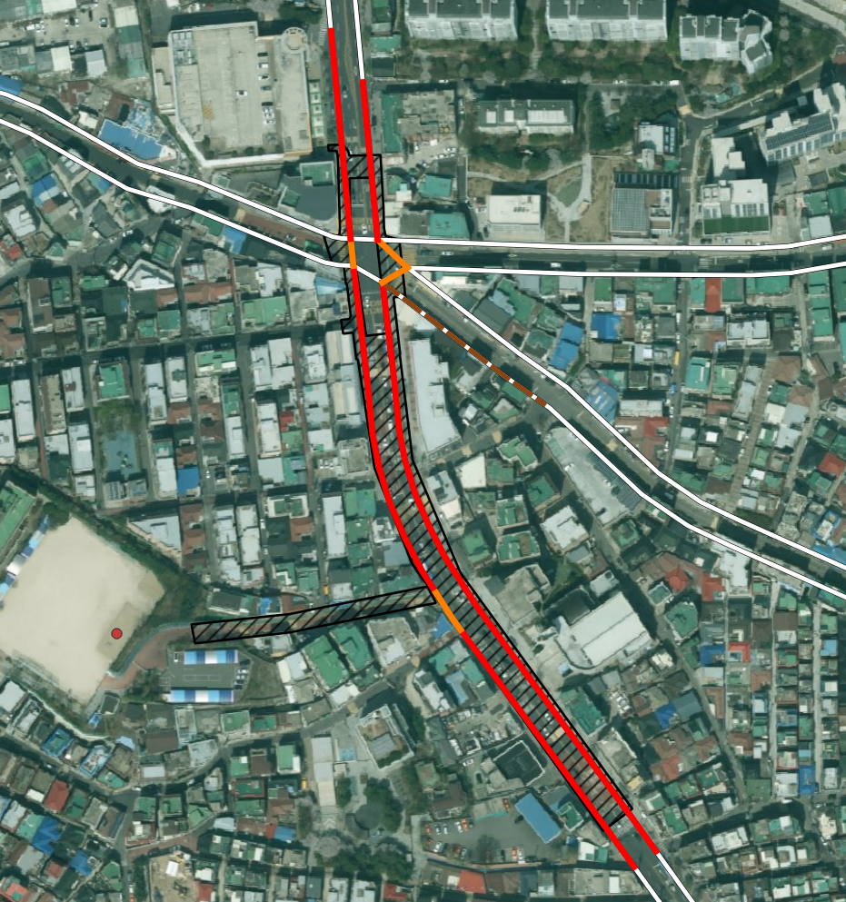

# 표준링크 매칭 2차 조건 재정의용 검수 패턴 로그

작성 시작일: 2026-07-09

이 문서는 QGIS 육안검수에서 발견되는 반복 패턴을 모으기 위한 기록이다. 앞으로 개별 사례에 번호를 붙이는 방식보다는, 조건을 재정의할 때 필요한 “문제 유형” 중심으로 정리한다.

현재 목표는 조건을 즉시 수정하는 것이 아니다. 약 15개 내외의 검수 장면을 모은 뒤, 공통 패턴을 기준으로 A/B/C/D/제외 조건을 한 번에 재정의한다.

## 분류 기준

| 분류 | 의미 |
| --- | --- |
| `SHOULD_INCLUDE_AUTO` | 자동 구축 대상에 포함되어야 함 |
| `SHOULD_INCLUDE_REVIEW` | 자동 구축은 애매하지만 검토 후보에는 포함되어야 함 |
| `SHOULD_EXCLUDE` | 후보에서 제외되어야 함 |
| `COVERAGE_GAP` | 표준링크 자체가 없거나 부족한 커버리지 문제 |
| `SOURCE_GEOMETRY_ISSUE` | 보호구역 원천 폴리곤 폭/형태 문제 |

## 패턴: 좁은 보호구역 폴리곤 때문에 실제 도로축이 A가 아니라 B/C로만 잡힘

분류:

```text
SHOULD_INCLUDE_AUTO
SOURCE_GEOMETRY_ISSUE
```

스냅샷:


관련 스냅샷:


관찰 내용:

- 보호구역 폴리곤이 실제 도로 전체 폭을 충분히 덮지 못한다.
- 표준링크는 보호구역 도로축과 같은 방향으로 이어지지만, 폴리곤과 직접 교차하지 않거나 교차가 약하다.
- QGIS 측정 기준 약 3~4m 정도 이격된 링크도 확인된다.
- 현재 2차 후보에서는 이런 링크가 A가 아니라 B/C 또는 제외 후보로 밀릴 수 있다.
- 사용자의 육안 판단 기준으로는 보호구역 운영 구간에 포함되는 링크이므로 자동 구축 대상에 포함되어야 한다.

현재 조건의 한계:

- “직접 교차”와 “교차 길이”를 중심으로 A를 정의하면, 원천 폴리곤 폭이 좁은 보호구역에서 참값을 놓친다.
- 단순 거리 후보를 줄이기 위해 C/D를 보수적으로 만든 것은 맞지만, 이 유형은 단순 거리 후보가 아니라 실제 도로축 후보다.

조건 재정의 시 고려사항:

- 직접 교차하지 않더라도, 보호구역 폴리곤 주변 일정 거리 안에서 링크가 충분히 긴 구간 동안 나란히 진행하면 A 후보가 될 수 있어야 한다.
- 단순히 5m 안에 잠깐 들어오는 링크와는 구분해야 한다.
- 거리 단독이 아니라 다음 지표를 함께 봐야 한다.
  - 보호구역 버퍼 안에서의 링크 중첩 길이
  - 보호구역 버퍼 안에서의 링크 중첩 비율
  - 보호구역 주축과 링크 방향의 유사성
  - 같은 보호구역 그룹 안의 다른 A/B seed와의 연결성

잠정 규칙 아이디어:

```text
near_parallel_corridor:
  intersects = false 또는 약한 intersects
  AND distance_m <= 5m
  AND link가 zone buffer 5m 안에서 일정 길이 이상 진행
  AND link 방향/도로축이 보호구역 주축과 일치
  => A 후보 검토
```

아직 확정하지 않는다. 추가 패턴을 더 모은 뒤 최종 조건을 정한다.

## 패턴: 짧은 링크지만 보호구역 폴리곤 내부에 명확히 포함됨

분류:

```text
SHOULD_INCLUDE_AUTO
```

스냅샷:


관찰 내용:

- 링크 객체 자체는 짧다.
- 하지만 보호구역 폴리곤 내부에 명확하게 포함된다.
- 실제 도로 연결 구조상 보호구역 내부 링크로 보는 것이 타당하다.
- 사용자의 육안 판단 기준으로는 A 등급이 맞다.

현재 조건의 한계:

- 2차 A 조건이 `intersection_length_m >= 20m`와 `intersection_ratio >= 0.20`을 동시에 요구하면, 짧은 객체는 A에서 탈락할 수 있다.
- 교차로 주변의 짧은 링크, 분할 링크, 연결부 링크는 절대 길이 기준만으로 보면 과소평가될 수 있다.

조건 재정의 시 고려사항:

- 짧은 링크는 절대 교차 길이보다 포함 비율을 더 중요하게 봐야 한다.
- 전체 링크 중 상당 부분이 보호구역 내부에 있으면, 절대 길이가 20m 미만이어도 A가 될 수 있다.
- 스쳐 지나가는 짧은 링크와 구분하기 위해 다음 지표를 함께 봐야 한다.
  - `intersection_ratio`
  - `link_midpoint_inside_zone`
  - 링크 시작점/종점 또는 중심점의 포함 여부

잠정 규칙 아이디어:

```text
short_link_inside_zone:
  intersects = true
  AND link_length_m < 20m
  AND intersection_ratio >= 0.50
  AND link_midpoint_inside_zone = true
  => A 후보 검토
```

아직 확정하지 않는다. 추가 패턴을 더 모은 뒤 최종 조건을 정한다.

## 패턴: 고저차가 있는 상부도로가 평면상 폴리곤을 통과해서 오탐으로 포함됨

분류:

```text
SHOULD_EXCLUDE
SOURCE_GEOMETRY_ISSUE
```

스냅샷:


관찰 내용:

- 표준링크가 평면 좌표상으로는 보호구역 폴리곤을 통과한다.
- 하지만 위성영상과 주변 도로 구조를 보면 해당 링크는 고저차가 있는 상부도로로 판단된다.
- 실제 보호구역은 하부 생활도로 또는 학교 접근 도로에 위치하는 것으로 보인다.
- 따라서 단순 평면 교차 기준으로 A 또는 B에 포함되면 오탐이다.

현재 조건의 한계:

- 현재 매칭은 2D geometry 기준이므로 상부도로/하부도로의 높이 차이를 직접 알 수 없다.
- 보호구역 폴리곤이 상부도로와 하부도로를 모두 평면상으로 덮으면, 상부도로 링크가 강한 교차 후보로 잡힐 수 있다.
- 교차 길이나 교차 비율이 충분해도 실제 보호구역 운영 대상이 아닐 수 있다.

조건 재정의 시 고려사항:

- 고저차가 있는 도로는 단순 2D 교차만으로 자동 A 처리하면 위험하다.
- 표준링크 속성에 도로 등급, 도로 유형, 연결로 여부, 자동차전용도로 여부, 고가/지하 관련 속성이 있는지 확인해야 한다.
- 속성만으로 구분이 어렵다면 다음 보조 신호를 검토한다.
  - 보호구역 시설 포인트와의 접근성
  - 하부 도로망과의 노드 연결성
  - 동일 보호구역 그룹 내 다른 후보 링크와의 연결성
  - 도로명/도로번호가 보호구역 주변 생활도로와 다른지 여부
  - 긴 직선 상위도로가 보호구역을 관통하지만 시설 포인트와 직접 연결되지 않는지 여부

잠정 규칙 아이디어:

```text
grade_separated_false_positive:
  intersects = true
  AND road_rank/road_type이 상위도로 또는 자동차 중심 도로 계열
  AND 보호구역 시설 포인트 또는 하부 생활도로 seed와 연결성이 낮음
  AND 주변 후보 중 별도의 하부도로 후보가 존재
  => A 자동 후보에서 제외 또는 NEEDS_REVIEW로 강등
```

아직 확정하지 않는다. 이 유형은 속성 확인이 필요하므로 표준링크의 `road_rank`, `road_type`, `connect`, `multi_link`, `road_name`, `road_no`를 함께 검토한다.

## v2.1 재검수 패턴: 입체도로 의심 규칙이 반대로 적용될 수 있음

분류:

```text
SHOULD_INCLUDE_AUTO
SHOULD_INCLUDE_REVIEW
V21_FALSE_NEGATIVE_RISK
GRADE_SEPARATION_REVIEW
```

관련 규칙:

```text
B_POTENTIAL_GRADE_SEPARATED
A_STRONG_OVERLAP
```

스냅샷:



지도 기준 확인:



관찰 내용:

- v2.1에서는 상위도로 또는 입체도로 의심 조건이 적용되어 일부 링크가 `B_POTENTIAL_GRADE_SEPARATED`로 강등될 수 있다.
- 하지만 실제 검토 결과, 보호구역 대상이 되는 도로는 북부간선도로 본선으로 판단된다.
- 의심해야 할 대상은 본선 자체가 아니라, 본선과 겹쳐 보이는 고가도로/지하도로/하부도로 관계다.
- 따라서 `road_rank`가 높거나 상위도로처럼 보인다는 이유만으로 자동 강등하면 반대로 참값을 놓칠 수 있다.

현재 조건의 한계:

- v2.1의 입체도로 의심은 “상위도로 + 폴리곤 중첩”을 단순히 B로 강등하는 방향이다.
- 그러나 보호구역이 실제로 간선도로 본선 위에 지정된 경우도 존재한다.
- 입체도로 문제는 특정 등급을 기계적으로 제외/강등하는 문제가 아니라, 겹쳐 있는 도로 중 보호구역 대상 도로가 무엇인지 확인하는 문제다.

다음 테스트 조건에서 고려할 보정:

- `B_POTENTIAL_GRADE_SEPARATED`는 자동 강등 규칙이 아니라 “검토 플래그”로 분리하는 편이 안전하다.
- 후보 등급은 A로 유지하되, `potential_grade_separated = true` 같은 플래그만 붙이는 방안을 검토한다.
- 실제 제외/강등은 다음 보조 정보가 있을 때만 수행한다.
  - 보호구역 시설 포인트와의 접근 경로가 본선이 아닌 하부도로로 연결됨
  - 같은 위치에 하부 생활도로 후보가 더 자연스럽게 존재함
  - 도로명/지도 표기가 보호구역 지정 대상과 다름
  - 터널/고가/지하 관련 속성 또는 별도 도로 구조 데이터가 있음

잠정 규칙 수정 아이디어:

```text
grade_separation_review:
  intersects = true
  AND road_rank IN high_rank
  AND 보호구역 폴리곤과 강하게 중첩
  => candidate_grade는 A 유지 가능
  => potential_grade_separated = true 플래그 부여
  => QGIS 검수에서 대상 도로 확인

grade_separation_downgrade:
  potential_grade_separated = true
  AND 더 적합한 하부/접근도로 후보가 존재
  AND 시설 포인트 접근성이 하부도로 쪽이 더 자연스러움
  => NEEDS_REVIEW 또는 EXCLUDE
```

이 패턴은 입체도로 의심을 자동 제외/강등 조건으로 사용하면 안 된다는 근거다. 입체도로가 겹쳐 있는 경우에는 실제 보호구역 대상 도로가 본선인지, 고가도로인지, 하부도로인지 확인하는 검수 플래그로 다루어야 한다.

### 표준링크 구조 속성 활용 원칙

현재 `mobility.std_link`에서 입체도로/특수도로 판단에 활용할 수 있는 후보 속성은 다음과 같다.

```text
road_type
connect
multi_link
road_rank
road_name
road_no
```

원천 `raw.raw_std_link_20260612`에는 추가로 다음 제한/참고 속성도 존재한다.

```text
rest_h
rest_w
rest_veh
remark
histremark
```

검토 결과:

- `road_type`은 `000`, `001`, `002`, `003`, `004` 값이 존재한다.
- `connect=1`은 고속도로/도시고속도로 연결로 계열에서 많이 나타난다.
- `multi_link=1`은 중용/복합 링크 후보로 보인다.
- `road_type=002/003/004`는 지하도로, 교량, 터널, 고가 등 입체/특수 구조 후보로 활용 가능성이 있다.
- 단, 코드 의미표가 아직 확정되지 않았으므로 값만으로 자동 제외하면 안 된다.

처리 원칙:

```text
입체도로/특수도로 속성 있음
=> 즉시 제외하지 않음
=> structure_review_flag 부여
=> 후보 등급은 공간 조건에 따라 유지
=> QGIS 검수에서 실제 대상 도로 확인
```

다만 다음 조건이 함께 만족되면 제외 또는 강등을 검토할 수 있다.

```text
structure_review_flag = true
AND 더 적합한 하부/접근도로 후보가 존재
AND 시설 포인트 접근성이 하부/접근도로 쪽이 더 자연스러움
AND 도로명/지도 표기상 보호구역 대상 도로와 다름
```

즉 입체도로 속성은 `제외 조건`이 아니라 `검수 우선순위 상승 조건`으로 먼저 사용한다.

## v2.1 재검수 패턴: 지하차도에 매칭된 오탐은 제외되어야 함

분류:

```text
SHOULD_EXCLUDE
V21_FALSE_POSITIVE
GRADE_SEPARATION_REVIEW
ROADVIEW_CONFIRMED
```

관련 규칙:

```text
A_STRONG_OVERLAP
A_NEAR_PARALLEL_CORRIDOR
structure_review_flag
```

스냅샷:


관찰 내용:

- 평면상 보호구역 폴리곤과 링크가 겹치거나 가까워 매칭 후보로 잡힐 수 있다.
- 하지만 카카오 로드뷰 확인 결과 해당 도로는 지하차도 구간이다.
- 실제 보호구역 대상 도로로 보기 어렵고, 매칭에서 제외되어야 한다.
- 이 사례는 입체도로 검토 플래그가 필요한 대표적인 오탐이다.

현재 조건의 한계:

- 2D 공간 매칭만으로는 지하차도와 지상 생활도로를 구분할 수 없다.
- 보호구역 폴리곤이 평면상 지하차도 위를 덮으면 강한 중첩 또는 근접 평행 후보로 잡힐 수 있다.
- 지하차도/고가도로 여부를 모르면 보호구역 대상이 아닌 링크를 자동 포함할 위험이 있다.

다음 테스트 조건에서 고려할 보정:

- 표준링크의 `road_type`, `connect`, `multi_link`, `road_rank`, `road_name`을 이용해 지하차도/고가/터널/교량 가능성을 플래그로 표시한다.
- `road_name`에 `지하차도`, `터널`, `고가`, `교`, `램프`, `IC`, `JC` 등 구조 관련 키워드가 포함되는지도 보조적으로 확인한다.
- 구조 플래그가 있고, 시설 포인트/보호구역 접근 도로와 직접 관련성이 낮으면 자동 A에서 제외하거나 `STRUCTURE_REVIEW`로 강등한다.

잠정 규칙 수정 아이디어:

```text
underpass_false_positive:
  structure_review_flag = true
  AND road_name 또는 road_type/connect/multi_link가 지하차도/고가/특수도로 가능성을 시사
  AND 보호구역 시설 포인트 접근 도로와 연결성이 낮음
  AND 주변에 더 적합한 지상 생활도로 후보가 존재
  => EXCLUDE 또는 STRUCTURE_REVIEW
```

이 패턴은 입체도로 속성을 단순 플래그로만 두는 것에서 한 걸음 더 나아가, 지하차도/고가도로가 보호구역 대상이 아닌 경우를 자동 후보에서 배제해야 한다는 근거다.

## 패턴: 회전교차로/교차로부는 개별 링크보다 컴포넌트 단위로 통째 매칭 필요

분류:

```text
SHOULD_INCLUDE_AUTO
SOURCE_GEOMETRY_ISSUE
```

스냅샷:


관찰 내용:

- 항공영상 기준 실제 도로 폭과 표준링크 중심선 위치가 크게 어긋나는 구간이 있다.
- 특히 회전교차로 또는 교차로부에서는 표준링크가 여러 짧은 조각으로 나뉘거나, 실제 차로 중심과 간격이 넓게 벌어진다.
- 보호구역 폴리곤은 회전교차로 전체 또는 접근부 일부를 포함하지만, 개별 링크 단위로 보면 일부는 폴리곤과 불일치한다.
- 사용자의 육안 판단 기준으로는 회전교차로 내부/연결부 링크를 통째로 같은 보호구역 매칭 대상으로 보는 것이 더 자연스럽다.

현재 조건의 한계:

- 개별 링크의 교차 길이, 거리, 비율만 보면 회전교차로 구성 링크 일부가 누락되거나 낮은 등급으로 밀릴 수 있다.
- 반대로 교차로 가장자리를 스치는 링크까지 들어올 수 있어, 개별 링크 단위 판단이 불안정하다.

조건 재정의 시 고려사항:

- 회전교차로 또는 복잡 교차로는 단일 링크가 아니라 노드 연결 컴포넌트 단위로 판단해야 한다.
- 보호구역과 강하게 매칭되는 seed 링크가 회전교차로 컴포넌트에 포함되면, 같은 컴포넌트의 짧은 연결 링크도 함께 매칭 대상으로 승격할 수 있다.
- 단, 모든 교차로 연결 링크를 무조건 포함하면 과매칭이 생기므로 다음 조건을 함께 봐야 한다.
  - seed 링크와 노드로 직접 연결되는지 여부
  - 링크 길이가 짧은 교차로 내부/접속 링크인지 여부
  - 보호구역 버퍼 안에 대부분 포함되는지 여부
  - 회전교차로 또는 교차로부로 볼 수 있는 다중 연결 노드인지 여부

잠정 규칙 아이디어:

```text
junction_component_match:
  A/B seed 링크가 존재
  AND 같은 junction component 안에 있음
  AND link_length_m이 짧거나 보호구역 buffer 내부 비율이 높음
  AND seed와 1~2 hop 이내로 연결
  => A 또는 B 후보로 승격
```

추가 확인 필요:

- 표준링크 속성 중 회전교차로 또는 연결로를 식별할 수 있는 값이 있는지 확인한다.
- `f_node_id`, `t_node_id` 기준으로 교차로 컴포넌트를 구성할 수 있는지 확인한다.
- 회전교차로는 자동 구축 대상으로 포함하되, 일반 대형 교차로에서는 과매칭을 막을 보조 조건이 필요하다.

## 패턴: 매우 작은 인접/접촉만으로 후보에 포함되는 과매칭

분류:

```text
SHOULD_EXCLUDE
```

스냅샷:


관찰 내용:

- 표준링크가 보호구역 폴리곤 근처에 있거나 일부 짧게 닿는다.
- 하지만 실제로 보호구역 도로축을 따라가는 링크라고 보기 어렵다.
- 이미지상 파란색 링크처럼 아주 작은 인접 관계만으로 후보에 포함된 것으로 보인다.
- 이런 후보는 자동 구축 대상이 아니며, 기본 후보에서도 제외하거나 매우 낮은 검토 등급으로 분리하는 것이 적절하다.

현재 조건의 한계:

- 거리 또는 짧은 교차만으로 후보를 만들면, 보호구역과 무관한 주변 링크가 포함될 수 있다.
- 특히 보호구역 폴리곤 끝단이나 모서리 주변에서 미세 인접 후보가 생기기 쉽다.

조건 재정의 시 고려사항:

- 인접 후보는 최소한 “충분한 길이로 함께 진행”해야 한다.
- 단순히 최단거리가 가깝다는 이유만으로 C/D에 포함하면 안 된다.
- 다음 중 하나라도 만족하지 못하면 제외 또는 `TOUCH_OR_TINY_ADJACENCY`로 분리한다.
  - 보호구역 버퍼 내부 링크 길이가 일정 기준 이상
  - 보호구역 버퍼 내부 링크 비율이 일정 기준 이상
  - A/B seed와 도로명/노드 연결성이 있음
  - 보호구역 주축과 링크 방향이 유사함

잠정 규칙 아이디어:

```text
tiny_adjacency_false_positive:
  distance_m <= 5m
  AND proximity_overlap_length_m < minimum_corridor_length
  AND proximity_overlap_ratio < minimum_corridor_ratio
  AND seed 연결성도 약함
  => EXCLUDE 또는 TOUCH_OR_TINY_ADJACENCY
```

이 패턴은 `near_parallel_corridor`와 짝을 이루는 반대 조건이다. 가까운 링크를 살리되, 아주 짧게 스치는 링크는 배제해야 한다.

## 현재까지의 누적 방향

A 등급은 하나의 조건으로 정의하기 어렵다. 최소한 다음 하위 유형이 필요하다.

```text
A = strong_overlap
 OR short_inside
 OR near_parallel_corridor
 OR junction_component_match
```

반대로 스쳐 지나가는 링크, 매우 작은 인접 링크, 고저차가 있는 상부도로는 교차/거리 조건만으로 A/B/C가 되면 안 된다.

향후 조건 재정의 초안:

```text
A = strong_overlap OR short_inside OR near_parallel_corridor
B = weak_but_plausible_overlap
C = connected_near_candidate
D = low_confidence_review_only
EXCLUDE = touch/graze/unrelated_nearby/no_seed
        OR grade_separated_upper_road
        OR tiny_adjacency
```

추가 검수 중에는 위 초안을 확정하지 않고, 패턴별로 어떤 지표가 필요한지만 누적한다.

## v2.1 테스트 조건 초안

2026-07-09 기준으로 누적된 패턴을 반영하여 다음 조건으로 재테스트한다.

### A 후보로 승격하는 조건

```text
A_STRONG_OVERLAP:
  intersects = true
  AND intersection_length_m >= 20
  AND intersection_ratio >= 0.20

A_SHORT_INSIDE:
  intersects = true
  AND link_length_m < 20
  AND intersection_ratio >= 0.50
  AND link_midpoint_inside_zone = true

A_NEAR_PARALLEL_CORRIDOR:
  distance_m <= 5
  AND proximity_overlap_length_m >= 20
  AND proximity_overlap_ratio >= 0.20

A_JUNCTION_COMPONENT:
  distance_m <= 5
  AND A/B seed와 node 연결
  AND (
    link_length_m <= 35
    OR proximity_overlap_ratio >= 0.50
  )
```

### B 후보 또는 검토 후보로 남기는 조건

```text
B_WEAK_OVERLAP:
  intersects = true
  AND intersection_length_m >= 10
  AND intersection_ratio >= 0.10

B_POTENTIAL_GRADE_SEPARATED:
  road_rank IN ('101', '102')
  AND intersects = true
  AND intersection_length_m >= 10
  AND intersection_ratio >= 0.10
```

`B_POTENTIAL_GRADE_SEPARATED`는 고가/상부도로 의심 링크를 자동 A로 올리지 않기 위한 임시 강등 규칙이다. 실제 고저차 여부는 표준링크 속성만으로 확정하기 어려우므로, 이번 테스트에서는 제외가 아니라 검토 후보로 남긴다.

### 제외 또는 낮은 신뢰도 후보로 분리하는 조건

```text
TINY_ADJACENCY:
  distance_m <= 5
  AND proximity_overlap_length_m < 10
  AND proximity_overlap_ratio < 0.10

TOUCH_OR_GRAZE:
  intersects = true
  AND (
    intersection_length_m < 10
    OR intersection_ratio < 0.10
  )
```

이 초안은 운영 반영 기준이 아니라 QGIS 2차 검수용 기준이다.

## v2.1 재검수 패턴: A3 근접 평행 보정이 본도로가 아닌 사이드 도로를 잡음

분류:

```text
SHOULD_EXCLUDE
V21_FALSE_POSITIVE
```

관련 규칙:

```text
A_NEAR_PARALLEL_CORRIDOR
```

스냅샷:



관찰 내용:

- v2.1에서 `A_NEAR_PARALLEL_CORRIDOR`로 잡힌 후보로 보인다.
- 링크가 보호구역 폴리곤 또는 버퍼와 평행하게 이어지기 때문에 A3 조건을 만족했을 가능성이 있다.
- 하지만 실제 보호구역 대상지는 본도로가 아니라 주변 사이드 도로/부도로와 매칭된 것으로 판단된다.
- 사용자의 육안 판단 기준으로는 보호구역 대상지가 아니므로 A 자동 후보가 되면 안 된다.

현재 조건의 한계:

- `near_parallel_corridor`는 좁은 폴리곤 때문에 본도로 링크가 빠지는 문제를 보정하기 위한 규칙이다.
- 그러나 “가깝고 평행하며 길게 이어진다”는 조건만으로는 본도로와 사이드 도로를 구분하지 못한다.
- 도로 폭이 넓거나 본선 옆에 부도로/측도가 있는 경우 A3 오탐이 발생할 수 있다.

다음 테스트 조건에서 고려할 보정:

- A3는 단독으로 A 자동 후보가 되기보다, 다음 보조 조건 중 일부를 요구해야 한다.
  - 보호구역 폴리곤의 중심선/장축과 더 가까운 링크인지
  - 시설 포인트와의 접근성이 본도로보다 자연스러운지
  - 같은 보호구역 그룹의 A1/A2 seed와 도로명/노드 연결성이 있는지
  - 후보 주변에 더 강한 A1/A2/A4 본도로 후보가 존재하는지
  - road_rank/road_type 또는 도로명 기준으로 본선/측도 구분이 가능한지

잠정 규칙 수정 아이디어:

```text
A_NEAR_PARALLEL_CORRIDOR 유지 조건:
  distance_m <= 5
  AND proximity_overlap_length_m >= 20
  AND proximity_overlap_ratio >= 0.20
  AND (
    same_road_as_seed = true
    OR connected_to_seed = true
    OR zone 중심축에 가장 가까운 후보
  )

side_road_false_positive:
  A3 후보
  AND 본도로 후보보다 시설/폴리곤 중심축과의 관계가 약함
  AND side road 또는 service road로 판단됨
  => A 자동 후보에서 제외 또는 NEEDS_REVIEW로 강등
```

아직 확정하지 않는다. A3는 현재 가장 과대 포함 가능성이 높은 규칙이므로, 추가 검수에서 집중적으로 본다.

## v2.1 재검수 패턴: A3 근접 평행 보정 정상 매칭

분류:

```text
SHOULD_INCLUDE_AUTO
V21_TRUE_POSITIVE
```

관련 규칙:

```text
A_NEAR_PARALLEL_CORRIDOR
```

스냅샷:



관찰 내용:

- 보호구역 폴리곤과 표준링크가 완전히 직접 중첩하지는 않지만, 같은 도로축을 따라 길게 평행하게 진행한다.
- 표준링크 중심선과 보호구역 폴리곤 사이의 위치 오차 또는 폴리곤 폭 문제로 인해 직접 중첩 기준만 쓰면 누락될 수 있는 유형이다.
- 사용자의 육안 판단 기준으로는 보호구역 대상 링크로 포함되는 것이 맞다.

조건 재정의 시 유지해야 할 특징:

- `A_NEAR_PARALLEL_CORRIDOR` 자체는 필요한 규칙이다.
- 다만 사이드 도로 오탐과 구분하기 위해 다음 신호가 필요하다.
  - 보호구역 폴리곤 장축과 링크 방향이 유사함
  - 보호구역 버퍼 안에서 링크가 충분히 긴 구간 동안 유지됨
  - 링크가 보호구역의 중앙 도로축 또는 대표 도로축에 가까움
  - 주변에 더 강한 본도로 후보가 따로 존재하지 않음

다음 테스트 조건에서 고려할 보정:

```text
A3 유지:
  proximity_overlap_length_m 충분
  AND proximity_overlap_ratio 충분
  AND 보호구역 주축과 방향 유사
  AND side road 후보보다 zone 중심축/시설 접근성이 더 자연스러움
```

이 패턴은 A3를 삭제하지 말고 정교화해야 한다는 근거다.

## v2.1 재검수 패턴: 긴 링크라도 보호구역 구간은 A3 근접 평행 보정 대상

분류:

```text
SHOULD_INCLUDE_AUTO
V21_TRUE_POSITIVE
```

관련 규칙:

```text
A_NEAR_PARALLEL_CORRIDOR
```

스냅샷:



관찰 내용:

- 표준링크 객체가 길어서 화면상으로는 보호구역 범위 밖까지 길게 이어져 보인다.
- 그러나 보호구역과 가까운 구간 자체는 같은 도로축을 따라가며, 근접 평행 보정 대상으로 보는 것이 맞다.
- 사용자의 육안 판단 기준으로는 정상 매칭이다.

조건 재정의 시 유지해야 할 기준:

- 링크 전체 길이가 길다는 이유만으로 A3를 배제하면 안 된다.
- A3 판단은 링크 전체 형상보다 보호구역 주변 구간에서의 근접 중첩 길이와 도로축 일치 여부를 우선해야 한다.
- 다만 긴 링크 전체를 운영 반영 대상으로 그대로 쓰면 보호구역 범위를 과도하게 확장할 수 있으므로, 최종 반영 단계에서는 링크 전체 반영과 보호구역 구간 clipping 또는 segment 관리 방식을 구분해야 한다.

잠정 규칙 유지 방향:

```text
A3 long-link true positive:
  link_length_m이 길어도
  AND 보호구역 주변 proximity_overlap_length_m이 충분
  AND 보호구역 주변 도로축이 일치
  => A3 유지
```

추가 설계 이슈:

```text
매칭 후보 판단 = link_id 단위
운영 반영 범위 = link 전체 또는 보호구역 영향 구간 segment 단위
```

이 패턴은 매칭 단계와 최종 반영 단계를 분리해야 한다는 근거다.

## v2.1 재검수 패턴: A3와 C는 정상이나 D 확장 연결 검토는 부적합

분류:

```text
SHOULD_INCLUDE_AUTO
SHOULD_INCLUDE_REVIEW
SHOULD_EXCLUDE
V21_MIXED_RESULT
```

관련 규칙:

```text
A_NEAR_PARALLEL_CORRIDOR
C_NEAR_CONNECTED_OR_SAME_ROAD
D_EXTENDED_NODE_CONNECTED
```

스냅샷:



관찰 내용:

- `A_NEAR_PARALLEL_CORRIDOR`는 보호구역 도로축과 맞는 정상 후보로 판단된다.
- `C_NEAR_CONNECTED_OR_SAME_ROAD`는 근접 연결 또는 동일도로 후보로서 매칭하는 것이 맞아 보인다.
- 반면 `D_EXTENDED_NODE_CONNECTED`는 보호구역 대상지로 보기 어렵고 부적합하다.
- 같은 보호구역 주변에서도 A3/C/D의 품질 차이가 뚜렷하게 나타난다.

현재 조건의 한계:

- D는 5m 초과 20m 이내의 확장 연결 후보라서 원래도 낮은 신뢰도였지만, 실제 검수에서는 부적합 사례가 강하게 나타난다.
- D가 노드 연결만으로 유지되면 보호구역과 동떨어진 주변 도로가 후보로 남을 수 있다.

다음 테스트 조건에서 고려할 보정:

- D는 기본 후보라기보다 `LOW_PRIORITY_REVIEW` 또는 제외 후보에 가깝게 다룬다.
- D를 유지하려면 단순 노드 연결 외에 추가 근거가 필요하다.
  - 같은 도로명/도로번호
  - 보호구역 버퍼 내부 중첩 길이/비율
  - A3 또는 C 후보와 연속된 도로축
  - 시설 포인트 접근 방향과의 일치
- C는 동일도로/근접연결 조건이 충분하면 유지할 수 있다.

잠정 규칙 수정 아이디어:

```text
C_NEAR_CONNECTED_OR_SAME_ROAD:
  distance_m <= 5
  AND seed와 same_road 또는 node 연결
  => 유지

D_EXTENDED_NODE_CONNECTED:
  5m < distance_m <= 20
  AND node 연결만 있음
  => 기본 제외 또는 LOW_PRIORITY_REVIEW

D 유지 예외:
  same_road_as_seed = true
  OR proximity_overlap_ratio가 충분
  OR A3/C와 같은 도로축으로 연속
```

이 패턴은 D 등급을 운영 후보군에서 더 보수적으로 다루어야 한다는 근거다.

## v2.1 재검수 패턴: 강한 직접중첩은 정상 매칭, 폴리곤과 먼 구간은 정상 미매칭

분류:

```text
SHOULD_INCLUDE_AUTO
SHOULD_EXCLUDE
V21_TRUE_POSITIVE
V21_TRUE_NEGATIVE
```

관련 규칙:

```text
A_STRONG_OVERLAP
NO_MATCH_WHEN_FAR_FROM_POLYGON
```

스냅샷:



관찰 내용:

- 적색으로 표시된 링크는 보호구역 폴리곤과 충분히 직접 중첩되어 잘 매칭된 것으로 판단된다.
- 반면 상단 구간은 실제 도로축은 이어지지만 보호구역 폴리곤과 거리가 멀어 매칭되지 않은 것으로 보인다.
- 사용자의 육안 판단 기준으로는 상단 구간이 매칭되지 않은 것이 정상이다.

조건 재정의 시 유지해야 할 기준:

- A1 강한 직접중첩은 유지해야 한다.
- 보호구역 폴리곤 또는 버퍼에서 충분히 벗어난 구간은 같은 도로축처럼 보여도 자동 확장하면 안 된다.
- 특히 보호구역 폴리곤의 실제 운영 범위가 짧은 경우, 도로 전체를 따라 과도하게 확장하지 않아야 한다.

잠정 규칙 유지 방향:

```text
strong_overlap_valid:
  intersects = true
  AND intersection_length_m >= 20
  AND intersection_ratio >= 0.20
  => A 유지

far_segment_unmatched_valid:
  distance_m > max_distance_m
  OR proximity_overlap_length_m 부족
  => 매칭하지 않음
```

이 패턴은 “같은 도로축이면 무조건 확장”하면 안 된다는 정상 미매칭 기준이다.

## v2.1 재검수 패턴: B 약한 중첩은 주변에 정상 A2가 있으면 후보 유지 필요성이 낮음

분류:

```text
SHOULD_EXCLUDE
V21_FALSE_POSITIVE
```

관련 규칙:

```text
B_WEAK_OVERLAP
A_SHORT_INSIDE
```

스냅샷:



관찰 내용:

- `B_WEAK_OVERLAP` 후보가 보호구역과 약하게 중첩되어 있다.
- 그러나 같은 주변 구간 안에 `A_SHORT_INSIDE` 후보가 정상적으로 매칭되어 있다.
- 사용자의 육안 판단 기준으로는 해당 B 후보는 보호구역 자동 구축 대상에 포함하지 않아도 된다.
- 즉 B 후보 자체가 완전히 무의미하다기보다, 더 강한 A 후보가 존재하는 상황에서는 중복 또는 잡음으로 판단된다.

현재 조건의 한계:

- v2.1은 약한 중첩을 B로 남겨 검토 가능하게 한다.
- 하지만 동일 보호구역 또는 동일 교차부 안에서 A2가 이미 정상 매칭된 경우, B 약한 중첩 후보까지 유지하면 검수 부담과 과매칭 가능성이 커진다.
- 특히 B가 교차로 연결부나 주변 도로를 살짝 걸치는 정도라면 A2가 우선되어야 한다.

다음 테스트 조건에서 고려할 보정:

- 같은 `zone_group_id` 또는 같은 보호구역 주변에 A1/A2/A4가 존재하면 B_WEAK_OVERLAP을 자동 후보군에서 제외하거나 별도 낮은 검토 상태로 강등한다.
- B는 “A 후보가 없는 구간에서 보조적으로 볼 후보”로 제한하는 방안을 검토한다.
- 단, A 후보가 본도로가 아니고 B가 실제 본도로인 경우도 있을 수 있으므로 단순 삭제는 위험하다.

잠정 규칙 수정 아이디어:

```text
weak_overlap_redundant:
  candidate = B_WEAK_OVERLAP
  AND same zone_group_id 안에 A_SHORT_INSIDE 또는 A_STRONG_OVERLAP 존재
  AND B 후보의 intersection_ratio가 낮음
  AND B 후보가 A 후보와 node/도로축으로 직접 이어지지 않음
  => EXCLUDE 또는 LOW_PRIORITY_REVIEW
```

이 패턴은 B 후보를 완전히 없애기보다는, A 후보 존재 여부에 따라 우선순위를 낮추는 방향이 적절하다.
