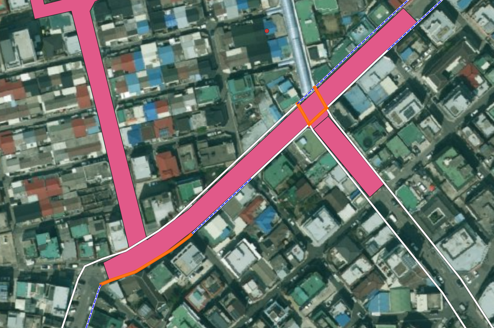
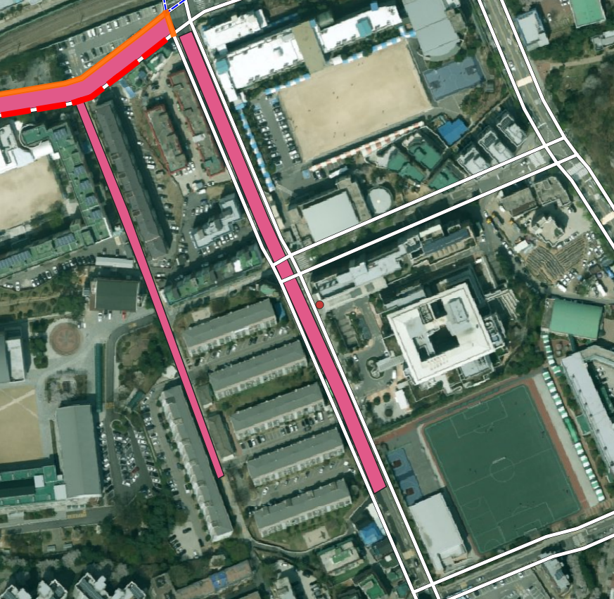
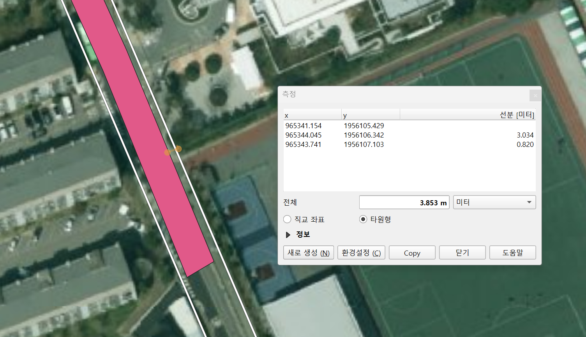
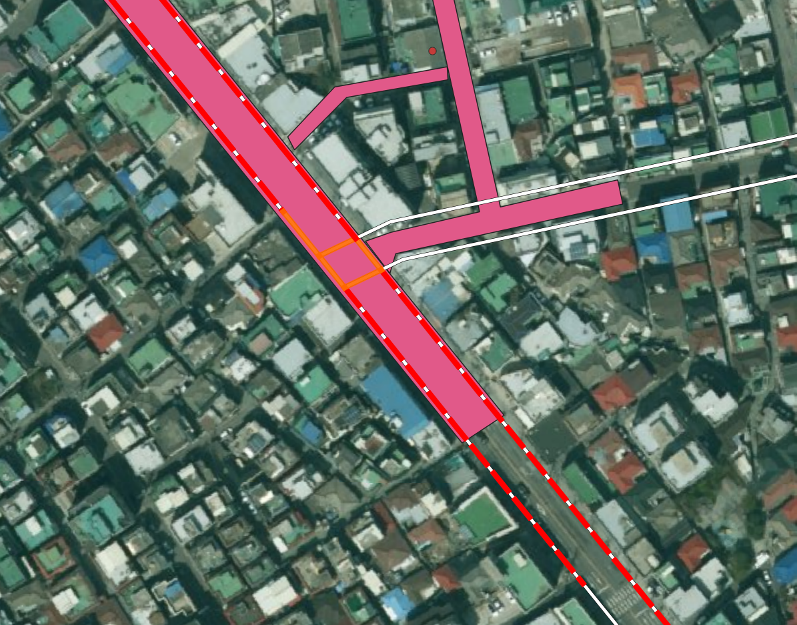
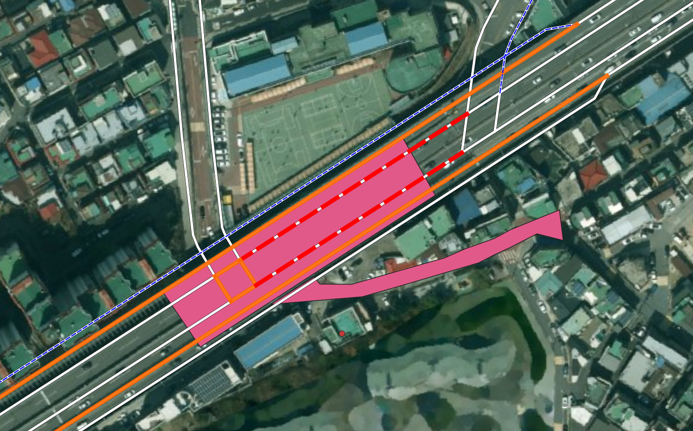
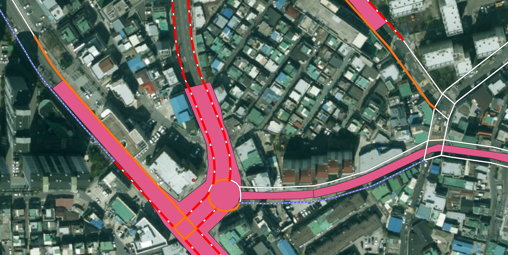
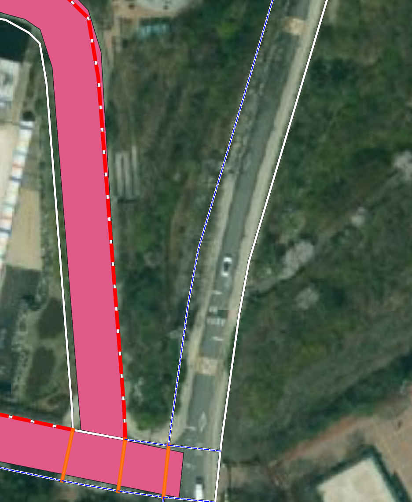

# 표준링크 매칭 2차 조건 재정의용 검수 패턴 로그

작성 시작일: 2026-07-09

이 문서는 QGIS 육안검수에서 발견되는 반복 패턴을 모으기 위한 기록이다. 앞으로 개별 사례에 번호를 붙이는 방식보다는, 조건을 재정의할 때 필요한 “문제 유형” 중심으로 정리한다.

현재 목표는 조건을 즉시 수정하는 것이 아니다. 약 15개 내외의 검수 장면을 모은 뒤, 공통 패턴을 기준으로 A/B/C/D/제외 조건을 한 번에 재정의한다.

## 분류 기준

| 분류 | 의미 |
| --- | --- |
| `SHOULD_INCLUDE_AUTO` | 자동 구축 대상에 포함되어야 함 |
| `SHOULD_INCLUDE_REVIEW` | 자동 구축은 애매하지만 검토 후보에는 포함되어야 함 |
| `SHOULD_EXCLUDE` | 후보에서 제외되어야 함 |
| `COVERAGE_GAP` | 표준링크 자체가 없거나 부족한 커버리지 문제 |
| `SOURCE_GEOMETRY_ISSUE` | 보호구역 원천 폴리곤 폭/형태 문제 |

## 패턴: 좁은 보호구역 폴리곤 때문에 실제 도로축이 A가 아니라 B/C로만 잡힘

분류:

```text
SHOULD_INCLUDE_AUTO
SOURCE_GEOMETRY_ISSUE
```

스냅샷:



관련 스냅샷:





관찰 내용:

- 보호구역 폴리곤이 실제 도로 전체 폭을 충분히 덮지 못한다.
- 표준링크는 보호구역 도로축과 같은 방향으로 이어지지만, 폴리곤과 직접 교차하지 않거나 교차가 약하다.
- QGIS 측정 기준 약 3~4m 정도 이격된 링크도 확인된다.
- 현재 2차 후보에서는 이런 링크가 A가 아니라 B/C 또는 제외 후보로 밀릴 수 있다.
- 사용자의 육안 판단 기준으로는 보호구역 운영 구간에 포함되는 링크이므로 자동 구축 대상에 포함되어야 한다.

현재 조건의 한계:

- “직접 교차”와 “교차 길이”를 중심으로 A를 정의하면, 원천 폴리곤 폭이 좁은 보호구역에서 참값을 놓친다.
- 단순 거리 후보를 줄이기 위해 C/D를 보수적으로 만든 것은 맞지만, 이 유형은 단순 거리 후보가 아니라 실제 도로축 후보다.

조건 재정의 시 고려사항:

- 직접 교차하지 않더라도, 보호구역 폴리곤 주변 일정 거리 안에서 링크가 충분히 긴 구간 동안 나란히 진행하면 A 후보가 될 수 있어야 한다.
- 단순히 5m 안에 잠깐 들어오는 링크와는 구분해야 한다.
- 거리 단독이 아니라 다음 지표를 함께 봐야 한다.
  - 보호구역 버퍼 안에서의 링크 중첩 길이
  - 보호구역 버퍼 안에서의 링크 중첩 비율
  - 보호구역 주축과 링크 방향의 유사성
  - 같은 보호구역 그룹 안의 다른 A/B seed와의 연결성

잠정 규칙 아이디어:

```text
near_parallel_corridor:
  intersects = false 또는 약한 intersects
  AND distance_m <= 5m
  AND link가 zone buffer 5m 안에서 일정 길이 이상 진행
  AND link 방향/도로축이 보호구역 주축과 일치
  => A 후보 검토
```

아직 확정하지 않는다. 추가 패턴을 더 모은 뒤 최종 조건을 정한다.

## 패턴: 짧은 링크지만 보호구역 폴리곤 내부에 명확히 포함됨

분류:

```text
SHOULD_INCLUDE_AUTO
```

스냅샷:



관찰 내용:

- 링크 객체 자체는 짧다.
- 하지만 보호구역 폴리곤 내부에 명확하게 포함된다.
- 실제 도로 연결 구조상 보호구역 내부 링크로 보는 것이 타당하다.
- 사용자의 육안 판단 기준으로는 A 등급이 맞다.

현재 조건의 한계:

- 2차 A 조건이 `intersection_length_m >= 20m`와 `intersection_ratio >= 0.20`을 동시에 요구하면, 짧은 객체는 A에서 탈락할 수 있다.
- 교차로 주변의 짧은 링크, 분할 링크, 연결부 링크는 절대 길이 기준만으로 보면 과소평가될 수 있다.

조건 재정의 시 고려사항:

- 짧은 링크는 절대 교차 길이보다 포함 비율을 더 중요하게 봐야 한다.
- 전체 링크 중 상당 부분이 보호구역 내부에 있으면, 절대 길이가 20m 미만이어도 A가 될 수 있다.
- 스쳐 지나가는 짧은 링크와 구분하기 위해 다음 지표를 함께 봐야 한다.
  - `intersection_ratio`
  - `link_midpoint_inside_zone`
  - 링크 시작점/종점 또는 중심점의 포함 여부

잠정 규칙 아이디어:

```text
short_link_inside_zone:
  intersects = true
  AND link_length_m < 20m
  AND intersection_ratio >= 0.50
  AND link_midpoint_inside_zone = true
  => A 후보 검토
```

아직 확정하지 않는다. 추가 패턴을 더 모은 뒤 최종 조건을 정한다.

## 패턴: 고저차가 있는 상부도로가 평면상 폴리곤을 통과해서 오탐으로 포함됨

분류:

```text
SHOULD_EXCLUDE
SOURCE_GEOMETRY_ISSUE
```

스냅샷:



관찰 내용:

- 표준링크가 평면 좌표상으로는 보호구역 폴리곤을 통과한다.
- 하지만 위성영상과 주변 도로 구조를 보면 해당 링크는 고저차가 있는 상부도로로 판단된다.
- 실제 보호구역은 하부 생활도로 또는 학교 접근 도로에 위치하는 것으로 보인다.
- 따라서 단순 평면 교차 기준으로 A 또는 B에 포함되면 오탐이다.

현재 조건의 한계:

- 현재 매칭은 2D geometry 기준이므로 상부도로/하부도로의 높이 차이를 직접 알 수 없다.
- 보호구역 폴리곤이 상부도로와 하부도로를 모두 평면상으로 덮으면, 상부도로 링크가 강한 교차 후보로 잡힐 수 있다.
- 교차 길이나 교차 비율이 충분해도 실제 보호구역 운영 대상이 아닐 수 있다.

조건 재정의 시 고려사항:

- 고저차가 있는 도로는 단순 2D 교차만으로 자동 A 처리하면 위험하다.
- 표준링크 속성에 도로 등급, 도로 유형, 연결로 여부, 자동차전용도로 여부, 고가/지하 관련 속성이 있는지 확인해야 한다.
- 속성만으로 구분이 어렵다면 다음 보조 신호를 검토한다.
  - 보호구역 시설 포인트와의 접근성
  - 하부 도로망과의 노드 연결성
  - 동일 보호구역 그룹 내 다른 후보 링크와의 연결성
  - 도로명/도로번호가 보호구역 주변 생활도로와 다른지 여부
  - 긴 직선 상위도로가 보호구역을 관통하지만 시설 포인트와 직접 연결되지 않는지 여부

잠정 규칙 아이디어:

```text
grade_separated_false_positive:
  intersects = true
  AND road_rank/road_type이 상위도로 또는 자동차 중심 도로 계열
  AND 보호구역 시설 포인트 또는 하부 생활도로 seed와 연결성이 낮음
  AND 주변 후보 중 별도의 하부도로 후보가 존재
  => A 자동 후보에서 제외 또는 NEEDS_REVIEW로 강등
```

아직 확정하지 않는다. 이 유형은 속성 확인이 필요하므로 표준링크의 `road_rank`, `road_type`, `connect`, `multi_link`, `road_name`, `road_no`를 함께 검토한다.

## 패턴: 회전교차로/교차로부는 개별 링크보다 컴포넌트 단위로 통째 매칭 필요

분류:

```text
SHOULD_INCLUDE_AUTO
SOURCE_GEOMETRY_ISSUE
```

스냅샷:



관찰 내용:

- 항공영상 기준 실제 도로 폭과 표준링크 중심선 위치가 크게 어긋나는 구간이 있다.
- 특히 회전교차로 또는 교차로부에서는 표준링크가 여러 짧은 조각으로 나뉘거나, 실제 차로 중심과 간격이 넓게 벌어진다.
- 보호구역 폴리곤은 회전교차로 전체 또는 접근부 일부를 포함하지만, 개별 링크 단위로 보면 일부는 폴리곤과 불일치한다.
- 사용자의 육안 판단 기준으로는 회전교차로 내부/연결부 링크를 통째로 같은 보호구역 매칭 대상으로 보는 것이 더 자연스럽다.

현재 조건의 한계:

- 개별 링크의 교차 길이, 거리, 비율만 보면 회전교차로 구성 링크 일부가 누락되거나 낮은 등급으로 밀릴 수 있다.
- 반대로 교차로 가장자리를 스치는 링크까지 들어올 수 있어, 개별 링크 단위 판단이 불안정하다.

조건 재정의 시 고려사항:

- 회전교차로 또는 복잡 교차로는 단일 링크가 아니라 노드 연결 컴포넌트 단위로 판단해야 한다.
- 보호구역과 강하게 매칭되는 seed 링크가 회전교차로 컴포넌트에 포함되면, 같은 컴포넌트의 짧은 연결 링크도 함께 매칭 대상으로 승격할 수 있다.
- 단, 모든 교차로 연결 링크를 무조건 포함하면 과매칭이 생기므로 다음 조건을 함께 봐야 한다.
  - seed 링크와 노드로 직접 연결되는지 여부
  - 링크 길이가 짧은 교차로 내부/접속 링크인지 여부
  - 보호구역 버퍼 안에 대부분 포함되는지 여부
  - 회전교차로 또는 교차로부로 볼 수 있는 다중 연결 노드인지 여부

잠정 규칙 아이디어:

```text
junction_component_match:
  A/B seed 링크가 존재
  AND 같은 junction component 안에 있음
  AND link_length_m이 짧거나 보호구역 buffer 내부 비율이 높음
  AND seed와 1~2 hop 이내로 연결
  => A 또는 B 후보로 승격
```

추가 확인 필요:

- 표준링크 속성 중 회전교차로 또는 연결로를 식별할 수 있는 값이 있는지 확인한다.
- `f_node_id`, `t_node_id` 기준으로 교차로 컴포넌트를 구성할 수 있는지 확인한다.
- 회전교차로는 자동 구축 대상으로 포함하되, 일반 대형 교차로에서는 과매칭을 막을 보조 조건이 필요하다.

## 패턴: 매우 작은 인접/접촉만으로 후보에 포함되는 과매칭

분류:

```text
SHOULD_EXCLUDE
```

스냅샷:



관찰 내용:

- 표준링크가 보호구역 폴리곤 근처에 있거나 일부 짧게 닿는다.
- 하지만 실제로 보호구역 도로축을 따라가는 링크라고 보기 어렵다.
- 이미지상 파란색 링크처럼 아주 작은 인접 관계만으로 후보에 포함된 것으로 보인다.
- 이런 후보는 자동 구축 대상이 아니며, 기본 후보에서도 제외하거나 매우 낮은 검토 등급으로 분리하는 것이 적절하다.

현재 조건의 한계:

- 거리 또는 짧은 교차만으로 후보를 만들면, 보호구역과 무관한 주변 링크가 포함될 수 있다.
- 특히 보호구역 폴리곤 끝단이나 모서리 주변에서 미세 인접 후보가 생기기 쉽다.

조건 재정의 시 고려사항:

- 인접 후보는 최소한 “충분한 길이로 함께 진행”해야 한다.
- 단순히 최단거리가 가깝다는 이유만으로 C/D에 포함하면 안 된다.
- 다음 중 하나라도 만족하지 못하면 제외 또는 `TOUCH_OR_TINY_ADJACENCY`로 분리한다.
  - 보호구역 버퍼 내부 링크 길이가 일정 기준 이상
  - 보호구역 버퍼 내부 링크 비율이 일정 기준 이상
  - A/B seed와 도로명/노드 연결성이 있음
  - 보호구역 주축과 링크 방향이 유사함

잠정 규칙 아이디어:

```text
tiny_adjacency_false_positive:
  distance_m <= 5m
  AND proximity_overlap_length_m < minimum_corridor_length
  AND proximity_overlap_ratio < minimum_corridor_ratio
  AND seed 연결성도 약함
  => EXCLUDE 또는 TOUCH_OR_TINY_ADJACENCY
```

이 패턴은 `near_parallel_corridor`와 짝을 이루는 반대 조건이다. 가까운 링크를 살리되, 아주 짧게 스치는 링크는 배제해야 한다.

## 현재까지의 누적 방향

A 등급은 하나의 조건으로 정의하기 어렵다. 최소한 다음 하위 유형이 필요하다.

```text
A = strong_overlap
 OR short_inside
 OR near_parallel_corridor
 OR junction_component_match
```

반대로 스쳐 지나가는 링크, 매우 작은 인접 링크, 고저차가 있는 상부도로는 교차/거리 조건만으로 A/B/C가 되면 안 된다.

향후 조건 재정의 초안:

```text
A = strong_overlap OR short_inside OR near_parallel_corridor
B = weak_but_plausible_overlap
C = connected_near_candidate
D = low_confidence_review_only
EXCLUDE = touch/graze/unrelated_nearby/no_seed
        OR grade_separated_upper_road
        OR tiny_adjacency
```

추가 검수 중에는 위 초안을 확정하지 않고, 패턴별로 어떤 지표가 필요한지만 누적한다.

## v2.1 테스트 조건 초안

2026-07-09 기준으로 누적된 패턴을 반영하여 다음 조건으로 재테스트한다.

### A 후보로 승격하는 조건

```text
A_STRONG_OVERLAP:
  intersects = true
  AND intersection_length_m >= 20
  AND intersection_ratio >= 0.20

A_SHORT_INSIDE:
  intersects = true
  AND link_length_m < 20
  AND intersection_ratio >= 0.50
  AND link_midpoint_inside_zone = true

A_NEAR_PARALLEL_CORRIDOR:
  distance_m <= 5
  AND proximity_overlap_length_m >= 20
  AND proximity_overlap_ratio >= 0.20

A_JUNCTION_COMPONENT:
  distance_m <= 5
  AND A/B seed와 node 연결
  AND (
    link_length_m <= 35
    OR proximity_overlap_ratio >= 0.50
  )
```

### B 후보 또는 검토 후보로 남기는 조건

```text
B_WEAK_OVERLAP:
  intersects = true
  AND intersection_length_m >= 10
  AND intersection_ratio >= 0.10

B_POTENTIAL_GRADE_SEPARATED:
  road_rank IN ('101', '102')
  AND intersects = true
  AND intersection_length_m >= 10
  AND intersection_ratio >= 0.10
```

`B_POTENTIAL_GRADE_SEPARATED`는 고가/상부도로 의심 링크를 자동 A로 올리지 않기 위한 임시 강등 규칙이다. 실제 고저차 여부는 표준링크 속성만으로 확정하기 어려우므로, 이번 테스트에서는 제외가 아니라 검토 후보로 남긴다.

### 제외 또는 낮은 신뢰도 후보로 분리하는 조건

```text
TINY_ADJACENCY:
  distance_m <= 5
  AND proximity_overlap_length_m < 10
  AND proximity_overlap_ratio < 0.10

TOUCH_OR_GRAZE:
  intersects = true
  AND (
    intersection_length_m < 10
    OR intersection_ratio < 0.10
  )
```

이 초안은 운영 반영 기준이 아니라 QGIS 2차 검수용 기준이다.
